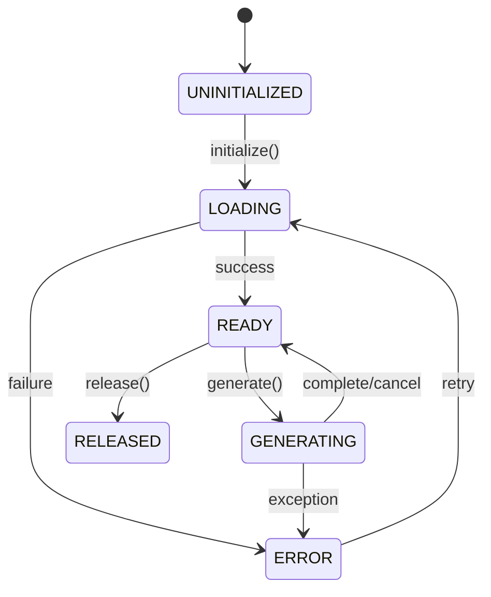
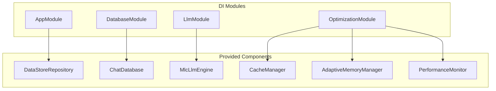
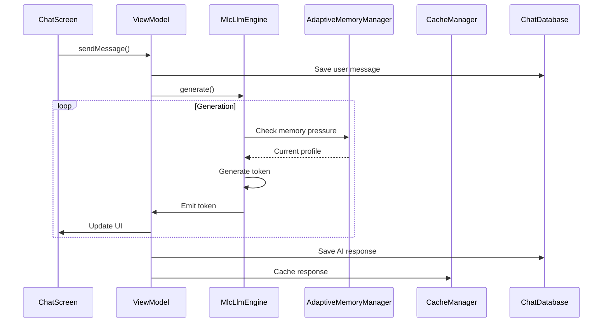

# Component Breakdown

## Table of Contents

1. [Introduction](#introduction)
2. [Component Hierarchy](#component-hierarchy)
3. [Presentation Layer Components](#presentation-layer-components)
4. [Domain Layer Components](#domain-layer-components)
5. [Service Layer Components](#service-layer-components)
6. [Data Layer Components](#data-layer-components)
7. [Component Interactions](#component-interactions)
8. [Interface Definitions](#interface-definitions)
9. [Related Documents](#related-documents)

---

## Introduction

### Purpose

This document provides a detailed breakdown of all components within the Nimittam Android application. It defines component responsibilities, interfaces, and interactions to support development, testing, and maintenance activities.

### Scope

This document covers:
- Component classification by architectural layer
- Detailed responsibility descriptions
- Interface contracts
- Dependency relationships
- Lifecycle considerations

---

## Component Hierarchy

### Package Structure

```
com.google.ai.edge.gallery/
├── GalleryApplication.kt          # Application entry point
├── MainActivity.kt                 # Main activity
├── GalleryLifecycleProvider.kt     # Lifecycle management
├── common/                         # Common utilities
│   ├── BatteryOptimizer.kt
│   ├── CrashHandler.kt
│   ├── MemoryManager.kt
│   ├── OfflineMode.kt
│   ├── SecureStorage.kt
│   ├── ThermalManager.kt
│   ├── Types.kt
│   └── Utils.kt
├── data/                          # Data layer
│   ├── Categories.kt
│   ├── Config.kt
│   ├── ConfigValue.kt
│   ├── Consts.kt
│   ├── DataStoreRepository.kt
│   ├── Tasks.kt
│   ├── Types.kt
│   ├── cache/
│   │   └── CacheManager.kt
│   └── db/                        # Database
│       ├── ChatDatabase.kt
│       ├── dao/
│       │   ├── ConversationDao.kt
│       │   └── MessageDao.kt
│       ├── entity/
│       │   ├── ConversationEntity.kt
│       │   └── MessageEntity.kt
│       └── repository/
│           └── ChatHistoryRepository.kt
├── di/                            # Dependency injection
│   ├── AppModule.kt
│   ├── DatabaseModule.kt
│   ├── LlmModule.kt
│   └── OptimizationModule.kt
├── llm/                           # LLM domain layer
│   ├── HardwareDetector.kt
│   ├── LlmEngine.kt
│   ├── ModelManager.kt
│   ├── README.md
│   └── engine/
│       └── MlcLlmEngine.kt
├── performance/                   # Performance monitoring
│   ├── PerformanceMonitor.kt
│   ├── RumPerformanceMonitor.kt
│   └── StartupTracer.kt
├── ui/                            # Presentation layer
│   ├── components/                # Reusable UI components
│   │   ├── Glassmorphism.kt
│   │   ├── NoiseTexture.kt
│   │   ├── RadialMenu.kt
│   │   ├── ScrollIndicators.kt
│   │   ├── ShapeMorphing.kt
│   │   ├── TypingIndicator.kt
│   │   └── Waveform.kt
│   ├── navigation/
│   │   └── Navigation.kt
│   ├── screens/                   # Screen composables
│   │   ├── capability/
│   │   │   └── ModelCapabilityScreen.kt
│   │   ├── chat/
│   │   │   └── ChatScreen.kt
│   │   ├── history/
│   │   │   └── HistoryScreen.kt
│   │   ├── onboarding/
│   │   │   └── OnboardingScreen.kt
│   │   ├── settings/
│   │   │   └── SettingsScreen.kt
│   │   ├── splash/
│   │   │   └── SplashScreen.kt
│   │   └── voice/
│   │       └── VoiceInputScreen.kt
│   └── theme/                     # Design system
│       ├── Animation.kt
│       ├── Colors.kt
│       ├── Shapes.kt
│       ├── Theme.kt
│       └── Type.kt
└── util/                          # Utilities
    └── memory/                    # Memory management
        ├── AdaptiveMemoryManager.kt
        ├── MemoryLeakDetector.kt
        ├── MemoryPool.kt
        └── WeakReferenceCache.kt
```

---

## Presentation Layer Components

### 1. ChatScreen

**File**: `ui/screens/chat/ChatScreen.kt`

**Responsibility**: Primary chat interface for user interaction with LLM

**Key Features**:
- Message list display with LazyColumn
- Input composer with send functionality
- Auto-scroll behavior for streaming responses
- Message styling (user vs. AI)

**Dependencies**:
- ChatViewModel (implied)
- Theme components
- UI components (Glassmorphism, TypingIndicator)

**State Management**:
- Messages list via StateFlow collection
- Input text state
- List scroll state

**Complexity Metrics**:
- Lines of Code: ~567
- Cyclomatic Complexity: 5 (ChatScreen composable)
- Maintainability Index: 82.1

---

### 2. UI Components

#### 2.1 Glassmorphism

**File**: `ui/components/Glassmorphism.kt`

**Responsibility**: Glass-like blur effects for modern UI aesthetics

**Usage**: Background effects, card overlays

---

#### 2.2 TypingIndicator

**File**: `ui/components/TypingIndicator.kt`

**Responsibility**: Animated indicator showing AI is generating response

**Usage**: Displayed during token generation

---

#### 2.3 Waveform

**File**: `ui/components/Waveform.kt`

**Responsibility**: Audio waveform visualization for voice input

**Usage**: Voice input screen

---

#### 2.4 RadialMenu

**File**: `ui/components/RadialMenu.kt`

**Responsibility**: Circular menu for quick actions

**Usage**: Contextual actions in chat

---

### 3. Theme System

#### 3.1 Colors

**File**: `ui/theme/Colors.kt`

**Responsibility**: Color palette definition

**Key Colors**:
- Obsidian (dark backgrounds)
- PureBlack (user messages)
- Gray12, Gray24 (AI messages)

---

#### 3.2 Typography

**File**: `ui/theme/Type.kt`

**Responsibility**: Typography scale and font definitions

---

#### 3.3 Animations

**File**: `ui/theme/Animation.kt`

**Responsibility**: Animation specifications and easing curves

---

## Domain Layer Components

### 1. LlmEngine (Interface)

**File**: `llm/LlmEngine.kt`

**Responsibility**: Abstract interface for LLM operations

**Methods**:
```kotlin
interface LlmEngine {
    suspend fun initialize(modelPath: String, config: ModelConfig): Result<Unit>
    fun generate(prompt: String, params: GenerationParams): Flow<GenerationResult>
    fun chat(messages: List<ChatMessage>, params: GenerationParams): Flow<GenerationResult>
    fun stopGeneration()
    fun resetContext()
    fun release()
}
```

**Implementations**:
- MlcLlmEngine

---

### 2. MlcLlmEngine

**File**: `llm/engine/MlcLlmEngine.kt`

**Responsibility**: MLC-LLM framework integration via JNI

**Key Features**:
- Native library loading and initialization
- Streaming token generation
- Backend selection (Vulkan, OpenCL, CPU)
- Metrics collection

**Dependencies**:
- Native libraries (libmlc_llm.so)
- AdaptiveMemoryManager
- HardwareDetector

**State Machine**:


**Complexity Metrics**:
- Lines of Code: ~480
- Max Cyclomatic Complexity: 10 (generate method)
- Maintainability Index: 78.4

**JNI Methods**:
- `nativeInit`: Initialize model
- `nativePrompt`: Process prompt
- `nativeGenerate`: Generate next token
- `nativeStop`: Stop generation
- `nativeReset`: Reset context
- `nativeRelease`: Release resources

---

### 3. ModelManager

**File**: `llm/ModelManager.kt`

**Responsibility**: Model lifecycle management

**Responsibilities**:
- Model asset extraction
- Model file management
- Version tracking

---

### 4. HardwareDetector

**File**: `llm/HardwareDetector.kt`

**Responsibility**: Detect available hardware acceleration

**Capabilities Detected**:
- Vulkan GPU support
- OpenCL GPU support
- Hexagon NPU support
- CPU capabilities

---

## Service Layer Components

### 1. PerformanceMonitor

**File**: `performance/PerformanceMonitor.kt`

**Responsibility**: System performance monitoring and metrics collection

**Metrics Tracked**:
- Frame time (UI performance)
- Memory usage (heap, native)
- CPU usage
- ANR detection

**Key Features**:
- Real-time metrics collection
- Configurable thresholds
- Listener notification system

**Dependencies**:
- AdaptiveMemoryManager
- Android system services

**Complexity Metrics**:
- Lines of Code: ~565
- Max Cyclomatic Complexity: 4
- Maintainability Index: 79.3

---

### 2. AdaptiveMemoryManager

**File**: `util/memory/AdaptiveMemoryManager.kt`

**Responsibility**: Dynamic memory pressure detection and response

**Pressure Levels**:
| Level | Threshold | Action |
|-------|-----------|--------|
| NORMAL | <70% | Full performance |
| ELEVATED | 70-80% | Cache: 80% |
| HIGH | 80-90% | Cache: 50%, Tokens: 50% |
| CRITICAL | >90% | Cache: 25%, Tokens: 25%, GC |

**Key Features**:
- 5-second polling interval
- Profile-based adaptation
- Listener notification
- Emergency cleanup

**Dependencies**:
- ActivityManager
- MemoryPoolManager
- ReferenceCacheManager

**Complexity Metrics**:
- Lines of Code: ~461
- Max Cyclomatic Complexity: 6
- Maintainability Index: 85.7

---

### 3. CacheManager

**File**: `data/cache/CacheManager.kt`

**Responsibility**: Multi-level caching infrastructure

**Cache Levels**:
| Level | Type | Size | Policy |
|-------|------|------|--------|
| L1 | Memory (LruCache) | 100 entries | LRU |
| L2 | Disk | 100MB | LRU + TTL |
| Bitmap | Memory | 64MB | Size-based LRU |

**Key Features**:
- Stale-while-revalidate pattern
- Predictive prefetching
- Statistics tracking
- Thread-safe operations

**Patterns**:
- Facade Pattern
- Template Method Pattern
- Observer Pattern

**Complexity Metrics**:
- Lines of Code: ~882
- Max Cyclomatic Complexity: 6
- Maintainability Index: 65.2

---

### 4. MemoryPoolManager

**File**: `util/memory/MemoryPool.kt`

**Responsibility**: Object pooling for memory efficiency

**Pools**:
- GenericObjectPool<T>
- BitmapPool
- ByteArrayPool
- StringBuilderPool

**Pattern**: Object Pool Pattern

---

### 5. BatteryOptimizer

**File**: `common/BatteryOptimizer.kt`

**Responsibility**: Battery-aware operation throttling

**Strategies**:
- Reduce token limits on low battery
- Disable animations when power saving
- Throttle inference when unplugged

---

### 6. ThermalManager

**File**: `common/ThermalManager.kt`

**Responsibility**: Thermal throttling response

**Thermal Actions**:
| State | Action |
|-------|--------|
| NORMAL | Full performance |
| MODERATE | Reduce speed |
| SEVERE | CPU only |
| CRITICAL | Pause inference |
| EMERGENCY | Emergency stop |

---

## Data Layer Components

### 1. ChatDatabase

**File**: `data/db/ChatDatabase.kt`

**Responsibility**: Room database for conversation persistence

**Entities**:
- ConversationEntity
- MessageEntity

**Pattern**: DAO Pattern

---

### 2. ConversationDao

**File**: `data/db/dao/ConversationDao.kt`

**Responsibility**: Conversation data access operations

---

### 3. MessageDao

**File**: `data/db/dao/MessageDao.kt`

**Responsibility**: Message data access operations

---

### 4. DataStoreRepository

**File**: `data/DataStoreRepository.kt`

**Responsibility**: Proto DataStore for settings persistence

**Storage**:
- User preferences
- Application settings
- Model configuration

---

## Component Interactions

### Dependency Injection Graph



### Runtime Interaction Flow



---

## Interface Definitions

### 1. LlmEngine Interface

```kotlin
interface LlmEngine {
    val state: StateFlow<LlmEngineState>
    val lastMetrics: StateFlow<InferenceMetrics?>
    
    suspend fun initialize(modelPath: String, config: ModelConfig): Result<Unit>
    fun generate(prompt: String, params: GenerationParams): Flow<GenerationResult>
    fun chat(messages: List<ChatMessage>, params: GenerationParams): Flow<GenerationResult>
    fun stopGeneration()
    fun resetContext()
    fun release()
}
```

### 2. PerformanceListener Interface

```kotlin
interface PerformanceListener {
    fun onFrameTimeExceeded(threshold: Float, actual: Float)
    fun onMemoryWarning(level: MemoryWarningLevel)
    fun onAnrDetected(stackTrace: String)
    fun onPerformanceReport(report: PerformanceReport)
}
```

### 3. MemoryPressureListener Interface

```kotlin
interface MemoryPressureListener {
    fun onMemoryPressureChanged(pressure: MemoryPressure, profile: MemoryProfile)
}
```

### 4. Cache Interface

```kotlin
interface Cache<K, V> {
    suspend fun get(key: K): V?
    suspend fun put(key: K, value: V, ttl: Duration? = null)
    suspend fun remove(key: K): V?
    suspend fun clear()
}
```

---

## Component Metrics Summary

| Component | LOC | Max CC | MI | Risk |
|-----------|-----|--------|-----|------|
| MlcLlmEngine | 480 | 10 | 78.4 | Medium |
| CacheManager | 882 | 6 | 65.2 | Low |
| AdaptiveMemoryManager | 461 | 6 | 85.7 | Low |
| PerformanceMonitor | 565 | 4 | 79.3 | Low |
| ChatScreen | 567 | 7 | 82.1 | Low |

---

## Related Documents

| Document | Relationship | Description |
|----------|--------------|-------------|
| [Architecture Overview](overview.md) | Parent | High-level architecture |
| [Design Patterns](patterns.md) | Implements | Pattern catalog |
| [API Specifications](../specifications/interfaces.md) | Details | Interface contracts |
| [Static Analysis](../analysis/static-analysis.md) | Validates | Code metrics |
| [Glossary](../references/glossary.md) | Reference | Terminology |

---

*Document maintained by the Technical Architecture Team*  
*Last updated: 2026-02-01*  
*Classification: ISO/IEC/IEEE 42010*
