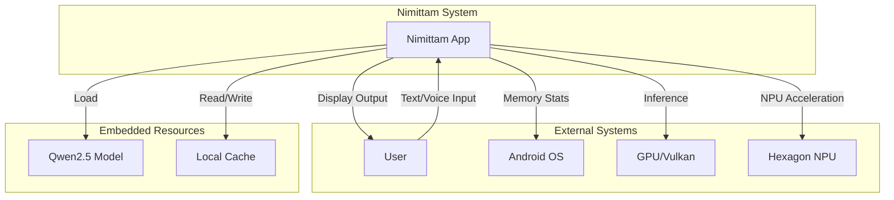
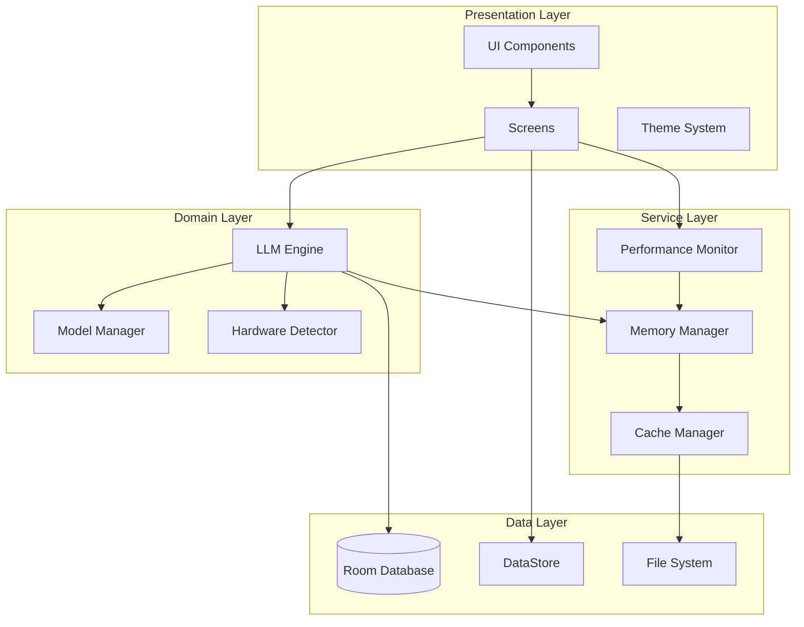
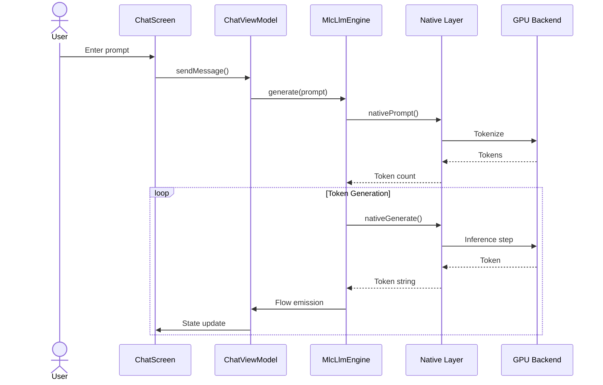
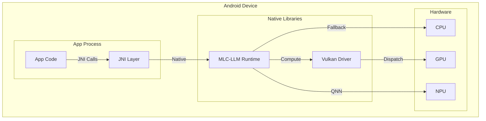

# Architecture Overview

## Table of Contents

1. [Introduction](#introduction)
2. [Architectural Goals](#architectural-goals)
3. [System Context](#system-context)
4. [Architectural Views](#architectural-views)
5. [Layered Architecture](#layered-architecture)
6. [Key Architectural Decisions](#key-architectural-decisions)
7. [Quality Attributes](#quality-attributes)
8. [Technology Stack](#technology-stack)
9. [Deployment Architecture](#deployment-architecture)
10. [Related Documents](#related-documents)

---

## Introduction

### Purpose

This document provides a high-level architectural overview of the Nimittam Android application—a privacy-first, on-device Large Language Model (LLM) inference system. It describes the structural and behavioral aspects of the system from multiple viewpoints to satisfy the concerns of diverse stakeholders.

### Scope

This overview covers:
- System boundaries and external interfaces
- Layered architectural structure
- Component organization and responsibilities
- Key architectural patterns and styles
- Quality attribute strategies

### Definitions and Acronyms

| Term | Definition |
|------|------------|
| LLM | Large Language Model |
| MLC-LLM | Machine Learning Compilation for Large Language Models (Apache TVM) |
| JNI | Java Native Interface |
| NPU | Neural Processing Unit |
| MVI | Model-View-Intent (architectural pattern) |
| DI | Dependency Injection |

### Stakeholder Concerns

| Stakeholder | Concern | Addressed In |
|-------------|---------|--------------|
| Developers | Component responsibilities | [Components](components.md) |
| Architects | Design patterns and rationale | [Patterns](patterns.md), [ADRs](../decisions/) |
| QA | Testability and coverage | [Traceability](../specifications/traceability.md) |
| DevOps | Deployment and scaling | [Deployment](#deployment-architecture) |

---

## Architectural Goals

### Primary Goals

1. **Privacy-First Design**: All LLM inference occurs on-device; no data leaves the device
2. **Real-Time Performance**: Sub-200ms first token latency with 15-30 tokens/second throughput
3. **Resource Efficiency**: Adaptive resource management under memory and thermal constraints
4. **Maintainability**: Clean architecture with clear separation of concerns
5. **Extensibility**: Plugin architecture for future LLM backends

### Quality Goals

| Quality Attribute | Target | Strategy |
|-------------------|--------|----------|
| Performance | 60fps UI, <200ms TTFT | GPU acceleration, caching |
| Reliability | 99.9% uptime | Error boundaries, graceful degradation |
| Security | On-device only | No network calls for inference |
| Maintainability | MI > 65 | Clean architecture, patterns |
| Usability | <2s cold start | Async initialization, caching |

---

## System Context

### Context Diagram



### External Interfaces

| Interface | Type | Description |
|-----------|------|-------------|
| User Input | Touch/Voice | Primary interaction mechanism |
| Android OS | System API | Memory, thermal, battery monitoring |
| GPU | Vulkan/OpenCL | LLM inference acceleration |
| NPU | Qualcomm SDK | Hardware-accelerated inference |

---

## Architectural Views

### Viewpoint: Functional Decomposition



### Viewpoint: Runtime Behavior



### Viewpoint: Deployment



---

## Layered Architecture

### Layer Overview

| Layer | Responsibility | Key Components |
|-------|---------------|----------------|
| Presentation | UI rendering, user interaction | Screens, Components, Theme |
| Domain | Business logic, LLM operations | Engine, Model Manager |
| Service | Cross-cutting concerns | Performance, Memory, Cache |
| Data | Persistence, storage | Database, DataStore, File System |

### Layer Dependencies

```
Presentation Layer
    ↓ (depends on)
Domain Layer
    ↓ (depends on)
Service Layer
    ↓ (depends on)
Data Layer
```

**Dependency Rule**: Dependencies only flow inward. Outer layers depend on inner layers, never the reverse.

### Detailed Layer Descriptions

#### 1. Presentation Layer

**Responsibility**: User interface rendering and interaction handling

**Components**:
- **Screens**: Full-screen composables (Chat, History, Settings)
- **Components**: Reusable UI elements (Glassmorphism, TypingIndicator)
- **Theme**: Design system (colors, typography, shapes, animations)

**Key Technologies**:
- Jetpack Compose
- Material Design 3
- Custom animation system

**Patterns**:
- MVI (Model-View-Intent)
- Unidirectional Data Flow
- State Hoisting

#### 2. Domain Layer

**Responsibility**: Core business logic and LLM operations

**Components**:
- **LlmEngine**: Interface for LLM operations
- **MlcLlmEngine**: MLC-LLM implementation
- **ModelManager**: Model lifecycle management
- **HardwareDetector**: Backend capability detection

**Key Technologies**:
- Kotlin Coroutines
- Kotlin Flow
- JNI for native integration

**Patterns**:
- Repository Pattern
- Strategy Pattern
- Adapter Pattern

#### 3. Service Layer

**Responsibility**: Cross-cutting concerns and system integration

**Components**:
- **PerformanceMonitor**: Frame time, memory, ANR detection
- **AdaptiveMemoryManager**: Memory pressure handling
- **CacheManager**: Multi-level caching (L1/L2)
- **BatteryOptimizer**: Power-aware operation
- **ThermalManager**: Thermal throttling response

**Key Technologies**:
- Android System Services
- Coroutine scopes
- StateFlow for reactive updates

**Patterns**:
- Observer Pattern
- Singleton Pattern
- Facade Pattern

#### 4. Data Layer

**Responsibility**: Data persistence and retrieval

**Components**:
- **ChatDatabase**: Room database for conversations
- **DataStoreRepository**: Proto DataStore for settings
- **CacheManager**: File-based L2 cache

**Key Technologies**:
- Room ORM
- Proto DataStore
- Java Serialization

**Patterns**:
- DAO Pattern
- Repository Pattern

---

## Key Architectural Decisions

### Decision 1: On-Device Inference

**Decision**: All LLM inference occurs on-device using embedded models.

**Rationale**:
- Privacy: No data transmission to external servers
- Latency: Eliminates network round-trips
- Offline capability: Works without internet connection

**Trade-offs**:
- Larger app size (~500MB-2GB for models)
- Higher device requirements (8GB+ RAM recommended)
- Limited to smaller models (0.5B-7B parameters)

**Related ADR**: [ADR-001: On-Device Inference Architecture](../decisions/ADR-001-on-device-inference.md)

### Decision 2: MLC-LLM Framework

**Decision**: Use Apache TVM's MLC-LLM for model deployment.

**Rationale**:
- Optimized for mobile deployment
- Multi-backend support (Vulkan, OpenCL, CPU)
- Quantization support for reduced memory footprint

**Trade-offs**:
- JNI complexity for Kotlin integration
- Limited to supported model architectures
- Build system complexity

### Decision 3: Clean Architecture with DI

**Decision**: Implement Clean Architecture with Hilt dependency injection.

**Rationale**:
- Testability: Easy mocking of dependencies
- Maintainability: Clear separation of concerns
- Flexibility: Easy to swap implementations

**Trade-offs**:
- Boilerplate code for module definitions
- Learning curve for new developers

### Decision 4: Reactive State Management

**Decision**: Use StateFlow and Compose for reactive UI updates.

**Rationale**:
- Automatic UI synchronization
- Lifecycle-aware state management
- Efficient recomposition

**Trade-offs**:
- Potential for excessive recomposition if not careful
- Debugging complexity with reactive streams

---

## Quality Attributes

### Performance

**Strategy**: GPU acceleration with adaptive quality

**Tactics**:
- Vulkan/OpenCL backend selection
- Adaptive token limits based on device capability
- Streaming token generation
- Multi-level caching

**Metrics**:
- First token latency: <200ms
- Token throughput: 15-30 tokens/second
- UI frame time: <16.67ms (60fps)

### Reliability

**Strategy**: Graceful degradation under resource constraints

**Tactics**:
- Memory pressure detection and response
- Thermal throttling adaptation
- Battery-aware operation
- Error boundaries in UI

**Metrics**:
- Crash-free rate: >99.9%
- ANR rate: <0.1%

### Security

**Strategy**: Defense in depth with on-device processing

**Tactics**:
- No network calls for inference
- Encrypted local storage
- Secure model storage

**Metrics**:
- Zero data exfiltration
- Encrypted data at rest

### Maintainability

**Strategy**: Clean code with comprehensive documentation

**Tactics**:
- Design pattern usage
- Complexity monitoring (CC < 10)
- Comprehensive test coverage
- Documentation standards

**Metrics**:
- Maintainability Index: >65
- Test coverage: >80%

---

## Technology Stack

### Core Technologies

| Category | Technology | Version | Purpose |
|----------|-----------|---------|---------|
| Language | Kotlin | 2.0+ | Primary development language |
| UI Framework | Jetpack Compose | 2024.02.00 | Declarative UI |
| DI Framework | Hilt | 2.51 | Dependency injection |
| Database | Room | 2.6.1 | Local persistence |
| Preferences | DataStore | 1.1.1 | Typed preferences |
| Async | Coroutines | 1.8.0 | Asynchronous programming |
| Native | NDK | 27.2.12479018 | Native development |

### Build Tools

| Tool | Version | Purpose |
|------|---------|---------|
| Gradle | 8.7 | Build system |
| Android Gradle Plugin | 8.5.0 | Android build |
| CMake | 3.22.1 | Native builds |
| Protocol Buffers | 4.28.2 | Serialization |

### External Libraries

| Library | Purpose |
|---------|---------|
| MLC-LLM | LLM inference runtime |
| Apache TVM | Model compilation |
| Material Design 3 | UI components |

---

## Deployment Architecture

### APK Structure

```
apk/
├── classes.dex          # Compiled Kotlin/Java
├── lib/
│   ├── arm64-v8a/
│   │   ├── libmlc_llm.so    # MLC-LLM runtime
│   │   └── libtvm_runtime.so # TVM runtime
│   └── ...
├── assets/
│   └── qwen2.5-0.5b/    # Embedded model
├── res/                 # Android resources
└── AndroidManifest.xml
```

### Device Requirements

| Requirement | Minimum | Recommended |
|-------------|---------|-------------|
| Android API | 31 (Android 12) | 34 (Android 14) |
| RAM | 6GB | 8GB+ |
| Storage | 2GB free | 4GB free |
| GPU | Vulkan 1.0 | Vulkan 1.1+ |

### Distribution

- **Primary**: Google Play Store
- **Alternative**: Direct APK distribution
- **Architecture**: ABI-specific APKs for optimized size

---

## Related Documents

| Document | Relationship | Description |
|----------|--------------|-------------|
| [Components](components.md) | Extends | Detailed component breakdown |
| [Patterns](patterns.md) | Implements | Design patterns catalog |
| [Static Analysis](../analysis/static-analysis.md) | Validates | Code quality assessment |
| [Dynamic Analysis](../analysis/dynamic-analysis.md) | Validates | Runtime behavior analysis |
| [API Specifications](../specifications/interfaces.md) | Details | Interface contracts |
| [ADRs](../decisions/) | Records | Architectural decisions |

---

## Appendix A: Architecture Decision Records

| ADR | Title | Status |
|-----|-------|--------|
| [ADR-001](../decisions/ADR-001-on-device-inference.md) | On-Device Inference | Accepted |
| [ADR-002](../decisions/ADR-002-mlc-llm-framework.md) | MLC-LLM Framework | Accepted |
| [ADR-003](../decisions/ADR-003-reactive-state-management.md) | Reactive State Management | Accepted |

---

## Appendix B: Glossary

See [Glossary](../references/glossary.md) for complete terminology definitions.

---

*Document maintained by the Technical Architecture Team*  
*Last updated: 2026-02-01*  
*Classification: ISO/IEC/IEEE 42010*
