# Design Patterns Catalog

## Table of Contents

1. [Introduction](#introduction)
2. [Creational Patterns](#creational-patterns)
3. [Structural Patterns](#structural-patterns)
4. [Behavioral Patterns](#behavioral-patterns)
5. [Architectural Patterns](#architectural-patterns)
6. [Modern Android Patterns](#modern-android-patterns)
7. [Pattern Usage Matrix](#pattern-usage-matrix)
8. [Related Documents](#related-documents)

---

## Introduction

### Purpose

This document catalogs all design patterns used in the Nimittam codebase, providing implementation details, rationale, and complexity analysis for each pattern.

### Pattern Classification

Patterns are organized according to the Gang of Four (GoF) classification:
- **Creational**: Object creation mechanisms
- **Structural**: Object composition and relationships
- **Behavioral**: Object interaction and responsibility distribution

Additionally, modern Android-specific patterns are documented.

---

## Creational Patterns

### 1. Singleton Pattern

**Classification**: Creational  
**GoF Category**: Object Creational

#### Purpose

Ensure a class has only one instance and provide global access to it.

#### Implementation

```kotlin
// MlcLlmEngine.kt
class MlcLlmEngine private constructor(
    private val context: Context
) : LlmEngine {
    
    companion object {
        @Volatile
        private var instance: MlcLlmEngine? = null
        
        fun getInstance(context: Context): MlcLlmEngine {
            return instance ?: synchronized(this) {
                instance ?: MlcLlmEngine(context.applicationContext).also {
                    instance = it
                }
            }
        }
    }
}
```

#### Usage in Codebase

| Implementation | Location | Purpose |
|---------------|----------|---------|
| MlcLlmEngine | `llm/engine/MlcLlmEngine.kt` | Single LLM engine instance |
| CacheManager | `data/cache/CacheManager.kt` | Single cache manager |
| PerformanceMonitor | `performance/PerformanceMonitor.kt` | Single monitor instance |
| AdaptiveMemoryManager | `util/memory/AdaptiveMemoryManager.kt` | Single memory manager |
| MemoryPoolManager | `util/memory/MemoryPool.kt` | Single pool manager |
| ReferenceCacheManager | `util/memory/WeakReferenceCache.kt` | Single reference cache |

#### UML Diagram

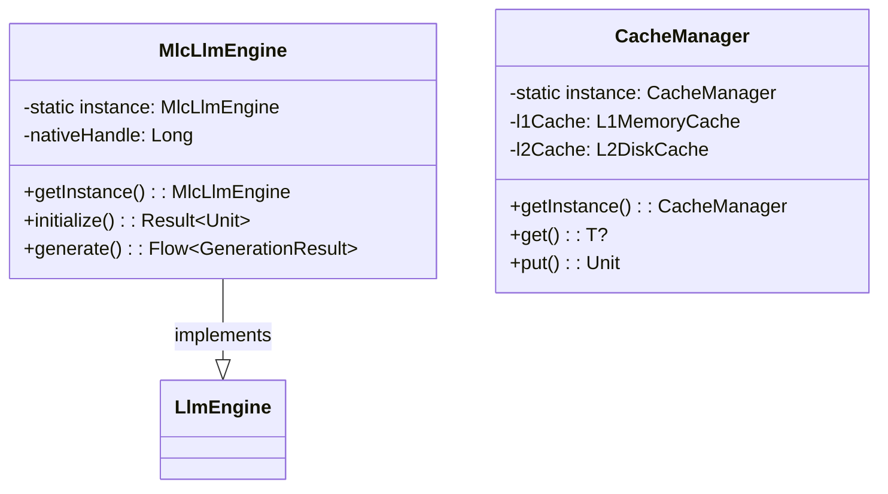

#### Complexity Contribution

**Low** - Hilt DI manages singleton lifecycle automatically in most cases.

---

### 2. Dependency Injection Pattern

**Classification**: Creational  
**GoF Category**: Object Creational (extended)

#### Purpose

Decouple object creation from usage, enabling testability and flexibility.

#### Implementation

```kotlin
// LlmModule.kt
@Module
@InstallIn(SingletonComponent::class)
abstract class LlmModule {
    @Binds
    abstract fun bindLlmEngine(
        impl: MlcLlmEngine
    ): LlmEngine
}

// OptimizationModule.kt
@Module
@InstallIn(SingletonComponent::class)
object OptimizationModule {
    @Provides
    @Singleton
    fun provideCacheManager(
        @ApplicationContext context: Context
    ): CacheManager = CacheManager.getInstance(context)
    
    @Provides
    @Singleton
    fun provideAdaptiveMemoryManager(
        @ApplicationContext context: Context,
        poolManager: MemoryPoolManager,
        refCache: ReferenceCacheManager
    ): AdaptiveMemoryManager = AdaptiveMemoryManager(
        context, poolManager, refCache
    )
}
```

#### Usage in Codebase

| Implementation | Location | Framework |
|---------------|----------|-----------|
| Constructor Injection | Throughout codebase | Hilt/Dagger |
| Module Providers | `di/*Module.kt` | Hilt Modules |
| Qualifier Usage | `@ApplicationContext` | Hilt Qualifiers |

#### UML Diagram

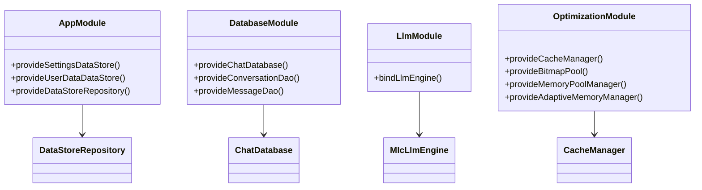

#### Complexity Contribution

**Low** - Framework handles complexity; improves testability.

---

### 3. Object Pool Pattern

**Classification**: Creational  
**GoF Category**: Object Creational

#### Purpose

Reuse expensive-to-create objects to reduce allocation overhead.

#### Implementation

```kotlin
// MemoryPool.kt
interface ObjectPool<T> {
    fun acquire(): T
    fun release(item: T)
    fun clear()
}

class GenericObjectPool<T>(
    private val factory: () -> T,
    private val reset: (T) -> Unit,
    private val maxSize: Int
) : ObjectPool<T> {
    private val available = ConcurrentLinkedQueue<T>()
    private val inUse = ConcurrentHashMap<T, Boolean>()
    
    override fun acquire(): T {
        val item = available.poll() ?: factory()
        inUse[item] = true
        return item
    }
    
    override fun release(item: T) {
        if (inUse.remove(item) != null) {
            reset(item)
            if (available.size < maxSize) {
                available.offer(item)
            }
        }
    }
}
```

#### Usage in Codebase

| Implementation | Location | Pooled Resource |
|---------------|----------|-----------------|
| GenericObjectPool<T> | `util/memory/MemoryPool.kt` | Generic objects |
| BitmapPool | `util/memory/MemoryPool.kt` | Bitmap instances |
| ByteArrayPool | `util/memory/MemoryPool.kt` | Byte arrays |
| StringBuilderPool | `util/memory/MemoryPool.kt` | StringBuilder instances |

#### UML Diagram

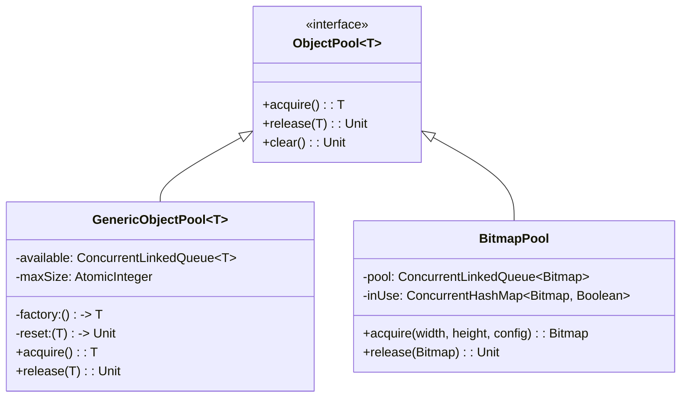

#### Complexity Contribution

**Medium** - Requires careful lifecycle management to prevent leaks.

---

## Structural Patterns

### 4. Adapter Pattern

**Classification**: Structural  
**GoF Category**: Class/Object Structural

#### Purpose

Convert the interface of a class into another interface clients expect.

#### Implementation

```kotlin
// LlmEngine.kt (Target Interface)
interface LlmEngine {
    suspend fun initialize(modelPath: String, config: ModelConfig): Result<Unit>
    fun generate(prompt: String, params: GenerationParams): Flow<GenerationResult>
    fun chat(messages: List<ChatMessage>, params: GenerationParams): Flow<GenerationResult>
    fun stopGeneration()
    fun resetContext()
    fun release()
}

// MlcLlmEngine.kt (Adapter)
class MlcLlmEngine @Inject constructor(
    @ApplicationContext private val context: Context,
    private val memoryManager: AdaptiveMemoryManager
) : LlmEngine {
    
    private val nativeHandleRef = AtomicLong(0L)
    
    // JNI methods (Adaptee)
    private external fun nativeInit(modelPath: String, config: String): Long
    private external fun nativePrompt(handle: Long, prompt: String): Int
    private external fun nativeGenerate(handle: Long, temperature: Float, topP: Float): String?
    private external fun nativeStop(handle: Long)
    private external fun nativeReset(handle: Long)
    private external fun nativeRelease(handle: Long)
    
    // Adapter implementation
    override fun generate(prompt: String, params: GenerationParams): Flow<GenerationResult> {
        return callbackFlow {
            // Adapt JNI calls to Flow-based API
            val handle = nativeHandleRef.get()
            val promptTokens = nativePrompt(handle, prompt)
            
            while (shouldContinue && isActive) {
                val token = nativeGenerate(handle, params.temperature, params.topP)
                if (token != null) {
                    trySend(GenerationResult.Token(token))
                }
            }
            
            awaitClose { nativeStop(handle) }
        }
    }
}
```

#### Usage in Codebase

| Implementation | Location | Adapts |
|---------------|----------|--------|
| MlcLlmEngine → LlmEngine | `llm/engine/MlcLlmEngine.kt` | MLC-LLM native library to Kotlin interface |
| FrameMetricsTracker | `performance/PerformanceMonitor.kt` | Choreographer to Compose |

#### UML Diagram

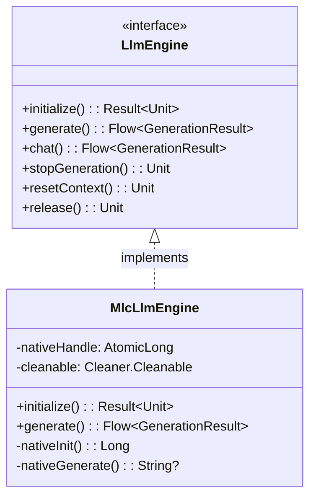

#### Complexity Contribution

**Medium** - JNI bridging adds native complexity.

---

### 5. Facade Pattern

**Classification**: Structural  
**GoF Category**: Object Structural

#### Purpose

Provide a unified interface to a set of interfaces in a subsystem.

#### Implementation

```kotlin
// CacheManager.kt
class CacheManager private constructor(
    private val context: Context
) {
    private val l1Cache = L1MemoryCache()
    private val l2Cache = L2DiskCache(context.cacheDir)
    private val bitmapCache = BitmapMemoryCache()
    private val prefetcher = PredictivePrefetcher()
    
    // Simplified interface hiding complex subsystem
    suspend fun <T : Serializable> get(key: String): T? {
        // Try L1 first
        l1Cache.get(key)?.let { return it.value as T }
        
        // Fall back to L2
        l2Cache.get(key)?.let { entry ->
            l1Cache.put(key, entry)
            return entry.value as T
        }
        
        return null
    }
    
    suspend fun <T : Serializable> put(key: String, value: T, ttl: Duration? = null) {
        coroutineScope {
            launch { l1Cache.put(key, CacheEntry(value, CacheMetadata(ttl))) }
            launch { l2Cache.put(key, CacheEntry(value, CacheMetadata(ttl))) }
        }
    }
    
    fun prefetch(keys: List<String>) {
        prefetcher.schedulePrefetch(keys)
    }
}
```

#### Usage in Codebase

| Implementation | Location | Simplifies |
|---------------|----------|------------|
| CacheManager | `data/cache/CacheManager.kt` | Multi-level cache operations |
| MemoryPoolManager | `util/memory/MemoryPool.kt` | Multiple pool coordination |
| AdaptiveMemoryManager | `util/memory/AdaptiveMemoryManager.kt` | Memory management complexity |

#### UML Diagram

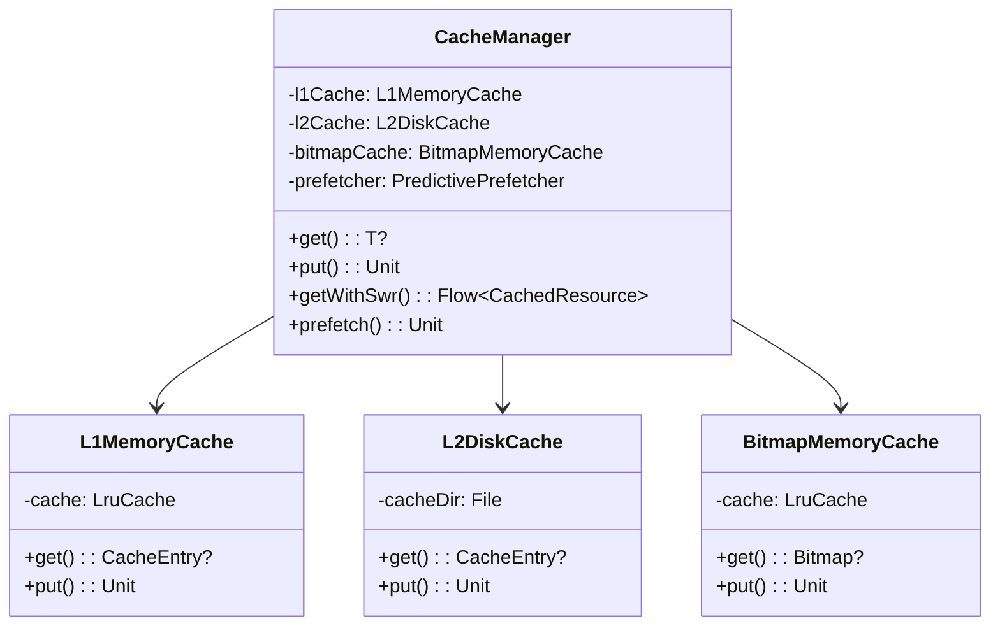

#### Complexity Contribution

**Low** - Reduces client complexity by hiding subsystem details.

---

### 6. Proxy Pattern

**Classification**: Structural  
**GoF Category**: Object Structural

#### Purpose

Provide a surrogate or placeholder for another object to control access to it.

#### Implementation

```kotlin
// WeakReferenceCache.kt
interface ReferenceCache<T> {
    fun put(key: String, value: T)
    fun get(key: String): T?
    fun remove(key: String): T?
}

class WeakReferenceCache<T> : ReferenceCache<T> {
    private val cache = ConcurrentHashMap<String, WeakReference<T>>()
    private val referenceQueue = ReferenceQueue<T>()
    
    override fun put(key: String, value: T) {
        cleanExpiredReferences()
        cache[key] = WeakReference(value, referenceQueue)
    }
    
    override fun get(key: String): T? {
        cleanExpiredReferences()
        return cache[key]?.get()
    }
    
    private fun cleanExpiredReferences() {
        var ref: WeakReference<*>?
        while (referenceQueue.poll().also { ref = it } != null) {
            cache.values.remove(ref)
        }
    }
}

class SoftReferenceCache<T> : ReferenceCache<T> {
    private val cache = ConcurrentHashMap<String, SoftReference<T>>()
    
    override fun put(key: String, value: T) {
        cache[key] = SoftReference(value)
    }
    
    override fun get(key: String): T? {
        return cache[key]?.get()
    }
}
```

#### Usage in Codebase

| Implementation | Location | Purpose |
|---------------|----------|---------|
| WeakReferenceCache | `util/memory/WeakReferenceCache.kt` | Memory-sensitive caching |
| SoftReferenceCache | `util/memory/WeakReferenceCache.kt` | GC-collectible caching |

#### UML Diagram

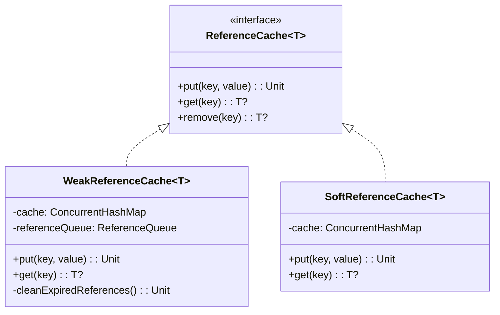

#### Complexity Contribution

**Low** - Transparent to clients, adds memory safety.

---

## Behavioral Patterns

### 7. Observer Pattern

**Classification**: Behavioral  
**GoF Category**: Object Behavioral

#### Purpose

Define a one-to-many dependency between objects so that when one object changes state, all its dependents are notified.

#### Implementation

```kotlin
// PerformanceMonitor.kt
interface PerformanceListener {
    fun onFrameTimeExceeded(threshold: Float, actual: Float)
    fun onMemoryWarning(level: MemoryWarningLevel)
    fun onAnrDetected(stackTrace: String)
    fun onPerformanceReport(report: PerformanceReport)
}

class PerformanceMonitor @Inject constructor() {
    private val listeners = mutableListOf<PerformanceListener>()
    private val _currentFrameMetrics = MutableStateFlow<FrameMetrics?>(null)
    val currentFrameMetrics: StateFlow<FrameMetrics?> = _currentFrameMetrics.asStateFlow()
    
    fun addListener(listener: PerformanceListener) {
        listeners.add(listener)
    }
    
    fun removeListener(listener: PerformanceListener) {
        listeners.remove(listener)
    }
    
    fun recordFrameTime(frameTimeMs: Float) {
        val metrics = FrameMetrics.fromFrameTime(frameTimeMs)
        _currentFrameMetrics.value = metrics
        
        if (frameTimeMs > FRAME_TIME_CRITICAL_THRESHOLD) {
            listeners.forEach { 
                it.onFrameTimeExceeded(FRAME_TIME_CRITICAL_THRESHOLD, frameTimeMs) 
            }
        }
    }
}

// AdaptiveMemoryManager.kt
interface MemoryPressureListener {
    fun onMemoryPressureChanged(pressure: MemoryPressure, profile: MemoryProfile)
}

class AdaptiveMemoryManager @Inject constructor(...) {
    private val listeners = mutableListOf<WeakReference<MemoryPressureListener>>()
    private val _memoryPressure = MutableStateFlow(MemoryPressure.NORMAL)
    val memoryPressure: StateFlow<MemoryPressure> = _memoryPressure.asStateFlow()
    
    fun addListener(listener: MemoryPressureListener) {
        listeners.add(WeakReference(listener))
    }
    
    private fun notifyListeners(pressure: MemoryPressure, profile: MemoryProfile) {
        listeners.removeAll { it.get() == null }
        listeners.forEach { it.get()?.onMemoryPressureChanged(pressure, profile) }
    }
}
```

#### Usage in Codebase

| Implementation | Location | Observable Event |
|---------------|----------|------------------|
| StateFlow usage | Throughout codebase | Reactive state updates |
| PerformanceListener | `performance/PerformanceMonitor.kt` | Performance events |
| MemoryPressureListener | `util/memory/AdaptiveMemoryManager.kt` | Memory pressure changes |
| LeakDetectionListener | `util/memory/MemoryLeakDetector.kt` | Memory leak detection |

#### UML Diagram

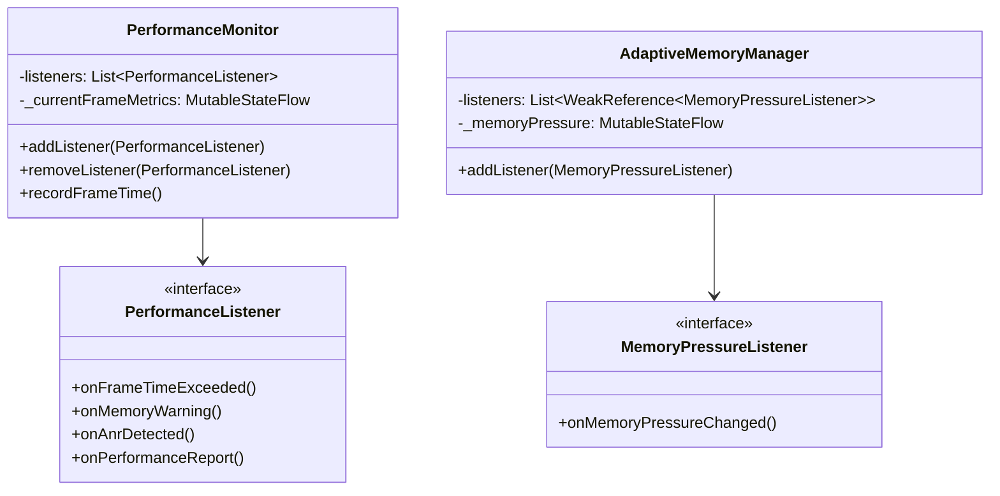

#### Complexity Contribution

**Low** - Kotlin Flows provide built-in observer infrastructure.

---

### 8. Strategy Pattern

**Classification**: Behavioral  
**GoF Category**: Object Behavioral

#### Purpose

Define a family of algorithms, encapsulate each one, and make them interchangeable.

#### Implementation

```kotlin
// HardwareBackend enum (Strategy selector)
enum class HardwareBackend {
    CPU,
    VULKAN_GPU,
    OPENCL_GPU,
    NPU_HEXAGON
}

// LlmEngine interface (Strategy interface)
interface LlmEngine {
    fun generate(prompt: String, params: GenerationParams): Flow<GenerationResult>
    fun chat(messages: List<ChatMessage>, params: GenerationParams): Flow<GenerationResult>
}

// MlcLlmEngine (Concrete Strategy)
class MlcLlmEngine @Inject constructor(...) : LlmEngine {
    
    private fun selectOptimalBackend(preferred: HardwareBackend): HardwareBackend {
        val supported = getSupportedBackends()
        return when {
            preferred in supported -> preferred
            HardwareBackend.VULKAN_GPU in supported -> HardwareBackend.VULKAN_GPU
            HardwareBackend.OPENCL_GPU in supported -> HardwareBackend.OPENCL_GPU
            else -> HardwareBackend.CPU
        }
    }
    
    override fun generate(prompt: String, params: GenerationParams): Flow<GenerationResult> {
        val backend = selectOptimalBackend(params.preferredBackend)
        // Use selected backend strategy
        return when (backend) {
            HardwareBackend.VULKAN_GPU -> generateWithVulkan(prompt, params)
            HardwareBackend.OPENCL_GPU -> generateWithOpenCL(prompt, params)
            HardwareBackend.CPU -> generateWithCPU(prompt, params)
            else -> generateWithCPU(prompt, params)
        }
    }
}

// MemoryProfile (Strategy for memory management)
data class MemoryProfile(
    val maxTokens: Int,
    val maxCacheSizeMB: Int,
    val enableAnimations: Boolean,
    val gcThreshold: Float
)

class AdaptiveMemoryManager @Inject constructor(...) {
    fun calculateOptimalProfile(): MemoryProfile {
        val memInfo = ActivityManager.MemoryInfo()
        activityManager.getMemoryInfo(memInfo)
        val totalMemoryMB = memInfo.totalMem / (1024 * 1024)
        
        return when {
            totalMemoryMB >= 8192 -> MemoryProfile(
                maxTokens = 2048,
                maxCacheSizeMB = 512,
                enableAnimations = true,
                gcThreshold = 0.85f
            )
            totalMemoryMB >= 6144 -> MemoryProfile(
                maxTokens = 1024,
                maxCacheSizeMB = 256,
                enableAnimations = true,
                gcThreshold = 0.80f
            )
            totalMemoryMB >= 4096 -> MemoryProfile(
                maxTokens = 512,
                maxCacheSizeMB = 128,
                enableAnimations = false,
                gcThreshold = 0.75f
            )
            else -> MemoryProfile(
                maxTokens = 256,
                maxCacheSizeMB = 64,
                enableAnimations = false,
                gcThreshold = 0.70f
            )
        }
    }
}
```

#### Usage in Codebase

| Implementation | Location | Strategies |
|---------------|----------|------------|
| HardwareBackend enum | `llm/` | CPU, VULKAN_GPU, OPENCL_GPU, NPU_HEXAGON |
| MemoryPressure enum | `util/memory/AdaptiveMemoryManager.kt` | NORMAL, ELEVATED, HIGH, CRITICAL |
| LlmEngine interface | `llm/LlmEngine.kt` | Different engine implementations |

#### UML Diagram

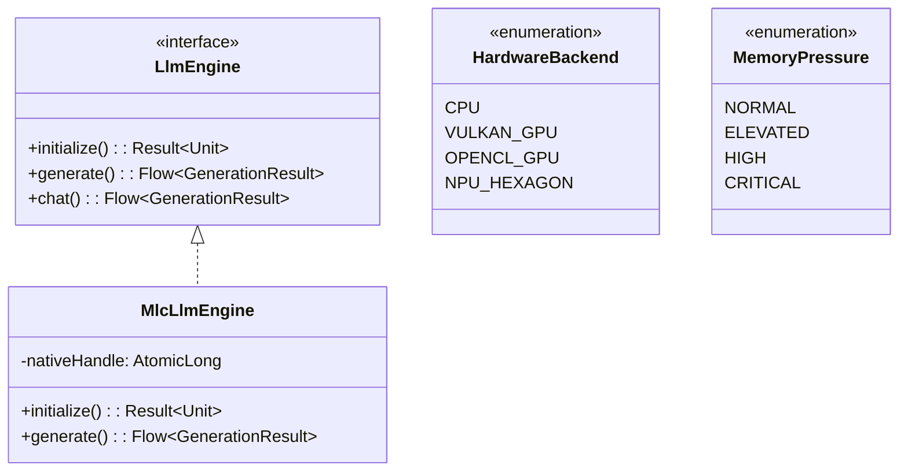

#### Complexity Contribution

**Low** - Clean separation of algorithm variations.

---

### 9. Command Pattern

**Classification**: Behavioral  
**GoF Category**: Object Behavioral

#### Purpose

Encapsulate a request as an object, thereby letting you parameterize clients with different requests.

#### Implementation

```kotlin
// CacheManager.kt - Fetch command with fallback
class CacheManager private constructor(...) {
    
    fun <T : Serializable> getWithSwr(
        key: String,
        fetcher: suspend () -> T,
        forceRefresh: Boolean = false
    ): Flow<CachedResource<T>> = flow {
        // Emit cached value immediately (even if stale)
        val cachedValue = get<T>(key)
        val isStale = isStale(key)
        
        if (cachedValue != null && !forceRefresh) {
            emit(CachedResource.Success(cachedValue, isFromCache = true, isStale = isStale))
        }
        
        // Fetch fresh data asynchronously
        try {
            val freshData = fetcher()
            put(key, freshData)
            emit(CachedResource.Success(freshData, isFromCache = false, isStale = false))
        } catch (e: Exception) {
            if (cachedValue == null) {
                emit(CachedResource.Error(e))
            }
        }
    }
}

// AdaptiveMemoryManager.kt - Conditional execution
class MemoryAwareExecutor @Inject constructor(
    private val memoryManager: AdaptiveMemoryManager
) {
    private val activeOperations = MutableStateFlow(0)
    
    suspend fun <T> executeIfAllowed(
        requiredMemoryMB: Int,
        block: suspend () -> T
    ): T? {
        val canExecute = memoryManager.canPerformOperation(requiredMemoryMB)
        if (!canExecute) return null
        
        activeOperations.update { it + 1 }
        return try {
            block()
        } finally {
            activeOperations.update { it - 1 }
        }
    }
    
    suspend fun <T> executeWithRetry(
        requiredMemoryMB: Int,
        maxRetries: Int = 3,
        block: suspend () -> T
    ): Result<T> {
        repeat(maxRetries) { attempt ->
            val result = executeIfAllowed(requiredMemoryMB, block)
            if (result != null) return Result.success(result)
            delay(100L * (attempt + 1))
        }
        return Result.failure(IllegalStateException("Failed after $maxRetries retries"))
    }
}

// CachedResource sealed class (Command result)
sealed class CachedResource<T> {
    data class Success<T>(
        val data: T,
        val isFromCache: Boolean,
        val isStale: Boolean
    ) : CachedResource<T>()
    
    data class Error<T>(val exception: Throwable) : CachedResource<T>()
    data class Loading<T> : CachedResource<T>()
}
```

#### Usage in Codebase

| Implementation | Location | Command Type |
|---------------|----------|--------------|
| CacheManager.getWithSwr() | `data/cache/CacheManager.kt` | Fetch command with fallback |
| MemoryAwareExecutor.executeIfAllowed() | `util/memory/AdaptiveMemoryManager.kt` | Conditional execution |

#### UML Diagram

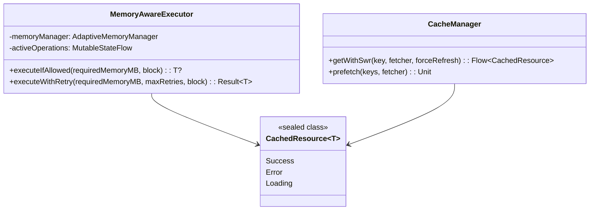

#### Complexity Contribution

**Medium** - Encapsulates execution logic with conditions.

---

### 10. Template Method Pattern

**Classification**: Behavioral  
**GoF Category**: Class Behavioral

#### Purpose

Define the skeleton of an algorithm in an operation, deferring some steps to subclasses.

#### Implementation

```kotlin
// L1MemoryCache.kt
abstract class BaseMemoryCache<K, V> {
    protected abstract val cache: LruCache<K, CacheEntry<V>>
    protected abstract val lock: Mutex
    
    // Template method
    suspend fun get(key: K): CacheEntry<V>? = lock.withLock {
        val entry = cache.get(key)
        entry?.let {
            val updatedEntry = it.copy(metadata = updateMetadata(it.metadata))
            cache.put(key, updatedEntry)
            updatedEntry
        }
    }
    
    suspend fun put(key: K, value: CacheEntry<V>) = lock.withLock {
        cache.put(key, value)
        onEntryAdded(key, value)
    }
    
    // Hook methods
    protected abstract fun updateMetadata(metadata: CacheMetadata): CacheMetadata
    protected open fun onEntryAdded(key: K, value: CacheEntry<V>) {}
    protected open fun onEntryEvicted(key: K, value: CacheEntry<V>) {}
}

// Concrete implementation
class L1MemoryCache<T> : BaseMemoryCache<String, T>() {
    override val cache = LruCache<String, CacheEntry<T>>(100)
    override val lock = Mutex()
    
    override fun updateMetadata(metadata: CacheMetadata): CacheMetadata {
        return metadata.withAccess()
    }
    
    override fun onEntryEvicted(key: String, value: CacheEntry<T>) {
        Log.d("L1Cache", "Evicted: $key")
    }
}

class BitmapMemoryCache : BaseMemoryCache<String, Bitmap>() {
    override val cache = LruCache<String, CacheEntry<Bitmap>>(
        calculateMaxSize()
    )
    override val lock = Mutex()
    private val metadataMap = ConcurrentHashMap<String, CacheMetadata>()
    
    override fun updateMetadata(metadata: CacheMetadata): CacheMetadata {
        return metadata.withAccess()
    }
    
    override fun onEntryEvicted(key: String, value: CacheEntry<Bitmap>) {
        value.value.recycle() // Bitmap-specific cleanup
    }
    
    private fun calculateMaxSize(): Int {
        val maxMemory = (Runtime.getRuntime().maxMemory() / 1024).toInt()
        return maxMemory / 8 // Use 1/8th of available memory
    }
}
```

#### Usage in Codebase

| Implementation | Location | Template Steps |
|---------------|----------|----------------|
| L1MemoryCache operations | `data/cache/CacheManager.kt` | Get/Put with metadata update |
| L2DiskCache operations | `data/cache/CacheManager.kt` | File I/O with cleanup |

#### UML Diagram

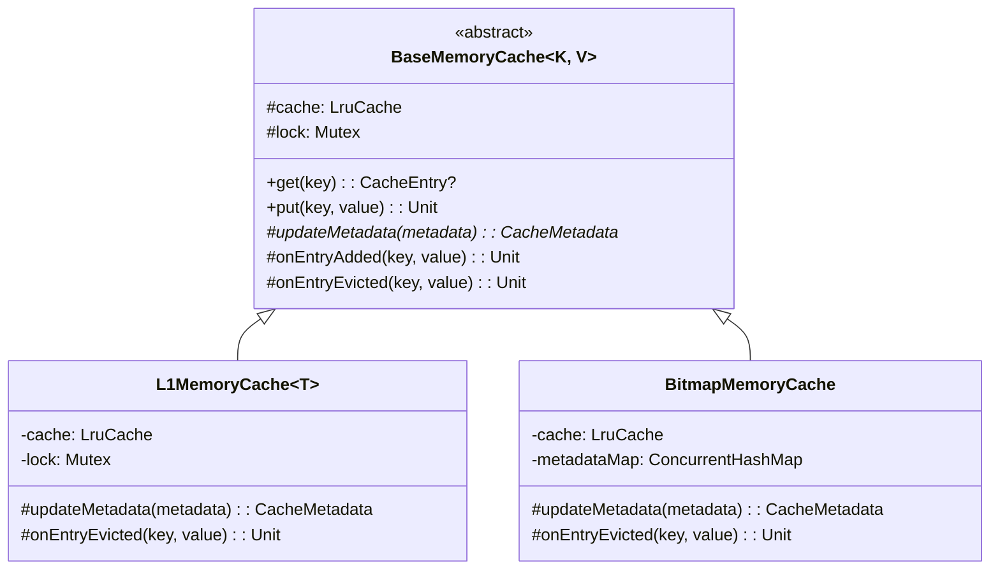

#### Complexity Contribution

**Low** - Provides consistent operation structure.

---

### 11. State Pattern

**Classification**: Behavioral  
**GoF Category**: Object Behavioral

#### Purpose

Allow an object to alter its behavior when its internal state changes.

#### Implementation

```kotlin
// LlmEngineState.kt
sealed class LlmEngineState {
    abstract val isOperational: Boolean
    
    object UNINITIALIZED : LlmEngineState() {
        override val isOperational = false
    }
    
    object LOADING : LlmEngineState() {
        override val isOperational = false
    }
    
    object READY : LlmEngineState() {
        override val isOperational = true
    }
    
    object GENERATING : LlmEngineState() {
        override val isOperational = true
    }
    
    data class ERROR(val exception: Throwable) : LlmEngineState() {
        override val isOperational = false
    }
    
    object RELEASED : LlmEngineState() {
        override val isOperational = false
    }
}

// MlcLlmEngine.kt
class MlcLlmEngine @Inject constructor(...) : LlmEngine {
    private val _state = MutableStateFlow<LlmEngineState>(LlmEngineState.UNINITIALIZED)
    override val state: StateFlow<LlmEngineState> = _state.asStateFlow()
    
    override suspend fun initialize(modelPath: String, config: ModelConfig): Result<Unit> {
        if (_state.value != LlmEngineState.UNINITIALIZED) {
            return Result.failure(IllegalStateException("Already initialized"))
        }
        
        _state.value = LlmEngineState.LOADING
        return try {
            // Initialization logic
            val handle = nativeInit(modelPath, config.toJson())
            nativeHandleRef.set(handle)
            _state.value = LlmEngineState.READY
            Result.success(Unit)
        } catch (e: Exception) {
            _state.value = LlmEngineState.ERROR(e)
            Result.failure(e)
        }
    }
    
    override fun generate(prompt: String, params: GenerationParams): Flow<GenerationResult> {
        return callbackFlow {
            when (val currentState = _state.value) {
                LlmEngineState.UNINITIALIZED -> {
                    trySend(GenerationResult.Error("Engine not initialized"))
                    close()
                }
                LlmEngineState.LOADING -> {
                    trySend(GenerationResult.Error("Engine loading"))
                    close()
                }
                is LlmEngineState.ERROR -> {
                    trySend(GenerationResult.Error("Engine error: ${currentState.exception.message}"))
                    close()
                }
                LlmEngineState.RELEASED -> {
                    trySend(GenerationResult.Error("Engine released"))
                    close()
                }
                else -> {
                    _state.value = LlmEngineState.GENERATING
                    // Generation logic
                }
            }
            awaitClose { _state.value = LlmEngineState.READY }
        }
    }
}
```

#### Usage in Codebase

| Implementation | Location | States |
|---------------|----------|--------|
| LlmEngineState | `llm/` | UNINITIALIZED, LOADING, READY, GENERATING, ERROR, RELEASED |

#### UML Diagram

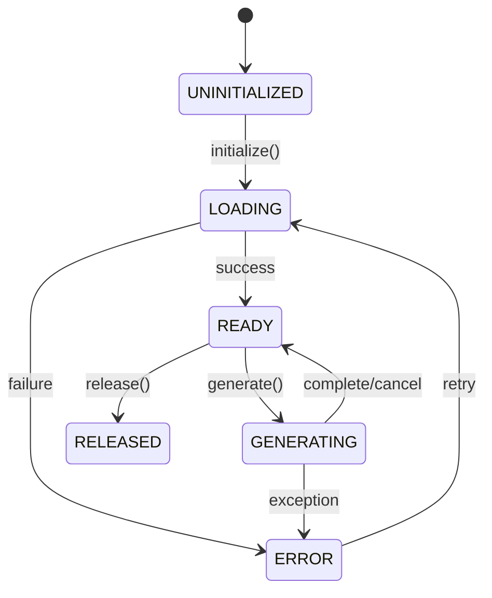

#### Complexity Contribution

**Low** - Clear state transitions prevent invalid operations.

---

## Architectural Patterns

### 12. Repository Pattern

**Classification**: Architectural
**Category**: Data Access

#### Purpose

Abstract data access logic and provide a clean API for data operations.

#### Implementation

```kotlin
// ChatHistoryRepository.kt
interface ChatHistoryRepository {
    suspend fun getConversations(): List<Conversation>
    suspend fun getConversation(id: Long): Conversation?
    suspend fun saveConversation(conversation: Conversation): Long
    suspend fun deleteConversation(id: Long)
    
    suspend fun getMessages(conversationId: Long): List<ChatMessage>
    suspend fun saveMessage(message: ChatMessage): Long
    suspend fun deleteMessages(conversationId: Long)
}

class ChatHistoryRepositoryImpl @Inject constructor(
    private val conversationDao: ConversationDao,
    private val messageDao: MessageDao
) : ChatHistoryRepository {
    
    override suspend fun getConversations(): List<Conversation> {
        return conversationDao.getAll().map { it.toDomain() }
    }
    
    override suspend fun getConversation(id: Long): Conversation? {
        return conversationDao.getById(id)?.toDomain()
    }
    
    override suspend fun saveConversation(conversation: Conversation): Long {
        return conversationDao.insert(conversation.toEntity())
    }
    
    override suspend fun deleteConversation(id: Long) {
        conversationDao.deleteById(id)
    }
    
    override suspend fun getMessages(conversationId: Long): List<ChatMessage> {
        return messageDao.getByConversationId(conversationId).map { it.toDomain() }
    }
    
    override suspend fun saveMessage(message: ChatMessage): Long {
        return messageDao.insert(message.toEntity())
    }
    
    override suspend fun deleteMessages(conversationId: Long) {
        messageDao.deleteByConversationId(conversationId)
    }
}
```

#### Usage in Codebase

| Implementation | Location | Data Source |
|---------------|----------|-------------|
| ChatHistoryRepository | `data/db/repository/ChatHistoryRepository.kt` | Room Database |
| DataStoreRepository | `data/DataStoreRepository.kt` | Proto DataStore |

---

### 13. Clean Architecture / Layered Architecture

**Classification**: Architectural
**Category**: System Organization

#### Implementation

See [Architecture Overview](overview.md) for detailed layer definitions.

```
Presentation Layer (UI)
    ↓ (depends on)
Domain Layer (Business Logic)
    ↓ (depends on)
Service Layer (Cross-cutting Concerns)
    ↓ (depends on)
Data Layer (Persistence)
```

---

## Modern Android Patterns

### 14. MVI (Model-View-Intent)

**Classification**: Presentation
**Category**: UI Architecture

#### Implementation

```kotlin
// ChatScreen.kt - View
@Composable
fun ChatScreen(
    viewModel: ChatViewModel = hiltViewModel()
) {
    val state by viewModel.state.collectAsState()
    
    // Render based on state
    when (state) {
        is ChatState.Loading -> LoadingIndicator()
        is ChatState.Messages -> MessageList((state as ChatState.Messages).messages)
        is ChatState.Error -> ErrorView((state as ChatState.Error).message)
    }
}

// ChatViewModel.kt - Model/Intent processing
@HiltViewModel
class ChatViewModel @Inject constructor(
    private val llmEngine: LlmEngine
) : ViewModel() {
    
    private val _state = MutableStateFlow<ChatState>(ChatState.Loading)
    val state: StateFlow<ChatState> = _state.asStateFlow()
    
    fun onIntent(intent: ChatIntent) {
        when (intent) {
            is ChatIntent.SendMessage -> sendMessage(intent.text)
            is ChatIntent.ClearChat -> clearChat()
            is ChatIntent.Retry -> retryLastMessage()
        }
    }
    
    private fun sendMessage(text: String) {
        viewModelScope.launch {
            _state.value = ChatState.Messages(currentMessages + userMessage(text))
            
            llmEngine.generate(text, defaultParams).collect { result ->
                when (result) {
                    is GenerationResult.Token -> appendToken(result.text)
                    is GenerationResult.Complete -> finishGeneration()
                    is GenerationResult.Error -> showError(result.message)
                }
            }
        }
    }
}

// Intents
sealed class ChatIntent {
    data class SendMessage(val text: String) : ChatIntent()
    object ClearChat : ChatIntent()
    object Retry : ChatIntent()
}

// States
sealed class ChatState {
    object Loading : ChatState()
    data class Messages(val messages: List<ChatMessage>) : ChatState()
    data class Error(val message: String) : ChatState()
}
```

---

### 15. Unidirectional Data Flow

**Classification**: Presentation
**Category**: State Management

#### Implementation

```kotlin
// Data flows in one direction
User Action → Intent → ViewModel → State → UI

// Example flow
User clicks send → SendMessage intent → ViewModel processes → State updates → UI recomposes
```

---

## Pattern Usage Matrix

| Pattern | Components Using | Complexity | Benefit |
|---------|-----------------|------------|---------|
| Singleton | 6 components | Low | Controlled instance management |
| Dependency Injection | All components | Low | Testability, flexibility |
| Object Pool | MemoryPool | Medium | Reduced allocation |
| Adapter | MlcLlmEngine | Medium | JNI abstraction |
| Facade | CacheManager, MemoryPoolManager | Low | Simplified API |
| Proxy | WeakReferenceCache | Low | Memory safety |
| Observer | PerformanceMonitor, AdaptiveMemoryManager | Low | Reactive updates |
| Strategy | HardwareBackend, MemoryProfile | Low | Algorithm flexibility |
| Command | CacheManager.getWithSwr | Medium | Encapsulated execution |
| Template Method | L1MemoryCache | Low | Consistent structure |
| State | LlmEngineState | Low | Clear transitions |
| Repository | ChatHistoryRepository | Low | Data abstraction |
| MVI | ChatScreen | Medium | Predictable state |
| Repository | All data access | Low | Clean data layer |

---

## Related Documents

| Document | Relationship | Description |
|----------|--------------|-------------|
| [Architecture Overview](overview.md) | Parent | High-level architecture |
| [Components](components.md) | Implements | Component details |
| [Static Analysis](../analysis/static-analysis.md) | Validates | Pattern impact on metrics |
| [Glossary](../references/glossary.md) | Reference | Pattern terminology |

---

*Document maintained by the Technical Architecture Team*
*Last updated: 2026-02-01*
*Classification: GoF Patterns / Modern Android Patterns*
