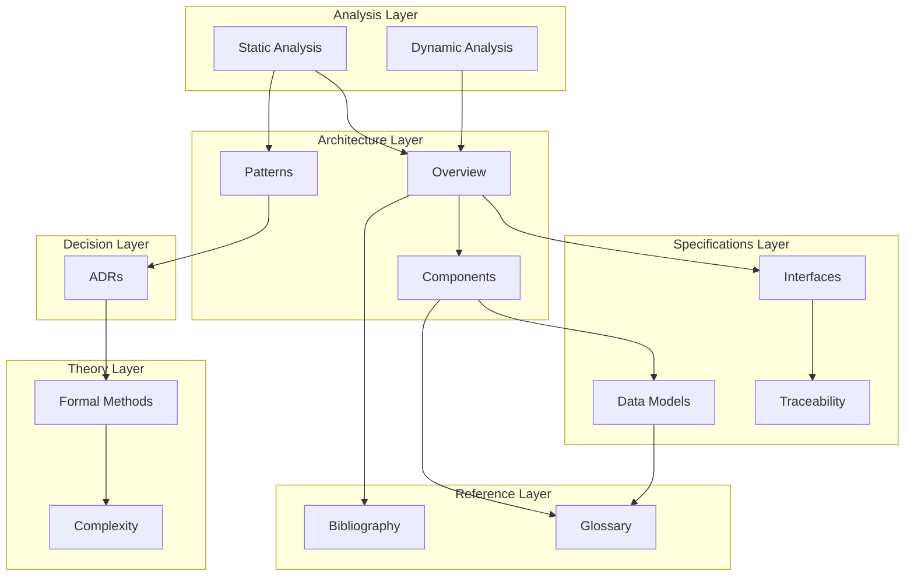

# Nimittam Documentation Suite

## Executive Overview

Welcome to the **Nimittam** comprehensive documentation suite. Nimittam is a privacy-first, on-device Large Language Model (LLM) inference Android application built on Apache TVM's MLC-LLM framework. This documentation follows IEEE 830-1998 (Software Requirements Specifications) and ISO/IEC/IEEE 42010 (Architectural Description) standards.

### Document Purpose

This documentation suite provides:
- **Architectural guidance** for developers and system architects
- **Technical specifications** for implementation details
- **Analysis reports** for code quality and performance characteristics
- **Decision records** capturing architectural evolution
- **Reference materials** for theoretical foundations and terminology

### Quick Reference Matrix

| Document | Purpose | Audience | Standard |
|----------|---------|----------|----------|
| [Architecture Overview](architecture/overview.md) | High-level system design | Architects, Tech Leads | ISO/IEC/IEEE 42010 |
| [Static Analysis](analysis/static-analysis.md) | Code quality metrics | Developers, QA | IEEE 1012 |
| [Dynamic Analysis](analysis/dynamic-analysis.md) | Runtime behavior | Performance Engineers | IEEE 1012 |
| [API Specifications](specifications/interfaces.md) | Interface contracts | Integrators | IEEE 830-1998 |
| [Design Patterns](architecture/patterns.md) | Pattern catalog | Developers | GoF Patterns |

---

## Documentation Structure

```
docs/
├── index.md                    ← You are here
├── architecture/               # Architectural documentation
│   ├── overview.md            # High-level architecture
│   ├── components.md          # Component breakdown
│   └── patterns.md            # Design patterns catalog
├── analysis/                   # Analysis reports
│   ├── static-analysis.md     # Code quality & complexity
│   └── dynamic-analysis.md    # Runtime behavior analysis
├── specifications/            # Technical specifications
│   ├── interfaces.md          # API specifications
│   ├── data-models.md         # Data model documentation
│   └── traceability.md        # Traceability matrices
├── visualizations/            # Diagrams and visualizations
│   ├── diagrams.md            # Mermaid diagrams
│   └── interactive.md         # p5.js visualizations
├── decisions/                 # Architecture Decision Records
│   └── ADR-*.md              # Individual ADRs
├── theory/                    # Theoretical foundations
│   ├── formal-methods.md      # Mathematical foundations
│   └── complexity.md          # Complexity theory
└── references/                # Citations and references
    ├── bibliography.md        # Full bibliography
    └── glossary.md            # Terminology definitions
```

---

## Document Relationships

### Information Flow Diagram



### Cross-Reference Index

| From Document | To Documents | Relationship |
|---------------|--------------|--------------|
| [Architecture Overview](architecture/overview.md) | [Components](architecture/components.md), [Patterns](architecture/patterns.md), [Static Analysis](analysis/static-analysis.md) | Extends, References |
| [Static Analysis](analysis/static-analysis.md) | [Patterns](architecture/patterns.md), [Complexity](theory/complexity.md) | Supports, Validates |
| [Dynamic Analysis](analysis/dynamic-analysis.md) | [Components](architecture/components.md), [Interfaces](specifications/interfaces.md) | Validates, Documents |
| [Design Patterns](architecture/patterns.md) | [Components](architecture/components.md), [ADRs](decisions/) | Implements, Records |
| [API Specifications](specifications/interfaces.md) | [Data Models](specifications/data-models.md), [Traceability](specifications/traceability.md) | Uses, Maps to |

---

## Getting Started

### For New Developers

1. Start with [Architecture Overview](architecture/overview.md) for system understanding
2. Review [Design Patterns](architecture/patterns.md) for implementation approaches
3. Study [API Specifications](specifications/interfaces.md) for integration points
4. Reference [Glossary](references/glossary.md) for terminology

### For System Architects

1. Begin with [Architecture Overview](architecture/overview.md) for structural context
2. Examine [Static Analysis](analysis/static-analysis.md) for quality metrics
3. Review [Dynamic Analysis](analysis/dynamic-analysis.md) for runtime characteristics
4. Study [Architecture Decision Records](decisions/) for rationale

### For Performance Engineers

1. Review [Dynamic Analysis](analysis/dynamic-analysis.md) for runtime metrics
2. Examine [Static Analysis](analysis/static-analysis.md) for complexity hotspots
3. Reference [Complexity Theory](theory/complexity.md) for algorithmic analysis
4. Study [Components](architecture/components.md) for optimization targets

### For QA Engineers

1. Review [Traceability Matrices](specifications/traceability.md) for coverage
2. Examine [Static Analysis](analysis/static-analysis.md) for risk areas
3. Reference [Dynamic Analysis](analysis/dynamic-analysis.md) for test scenarios
4. Study [API Specifications](specifications/interfaces.md) for test design

---

## Documentation Standards

### IEEE 830-1998 Compliance

This documentation suite adheres to IEEE 830-1998 (Recommended Practice for Software Requirements Specifications) through:

- **Functional Requirements**: Documented in [API Specifications](specifications/interfaces.md)
- **External Interfaces**: Detailed in [Interfaces](specifications/interfaces.md) and [Data Models](specifications/data-models.md)
- **Performance Requirements**: Captured in [Dynamic Analysis](analysis/dynamic-analysis.md)
- **Design Constraints**: Recorded in [Architecture Decision Records](decisions/)

### ISO/IEC/IEEE 42010 Compliance

Architectural documentation follows ISO/IEC/IEEE 42010 (Systems and Software Engineering — Architecture Description) through:

- **Architecture Viewpoints**: Defined in [Architecture Overview](architecture/overview.md)
- **Architecture Views**: Presented in [Components](architecture/components.md)
- **Architecture Models**: Illustrated in [Visualizations](visualizations/)
- **Rationale**: Captured in [Architecture Decision Records](decisions/)

### Document Metadata

Each document includes YAML frontmatter with:
- `title`: Document title
- `version`: Document version
- `date`: Last updated date
- `status`: Document status (Draft/Active/Deprecated)
- `classification`: Compliance standard reference

---

## Version Control

| Version | Date | Changes | Author |
|---------|------|---------|--------|
| 1.0.0 | 2026-02-01 | Initial documentation suite creation | Architecture Team |

---

## Navigation Guide

### By Topic

#### Architecture
- [Overview](architecture/overview.md) - System architecture and design principles
- [Components](architecture/components.md) - Detailed component breakdown
- [Patterns](architecture/patterns.md) - Design patterns catalog

#### Analysis
- [Static Analysis](analysis/static-analysis.md) - Code quality and complexity metrics
- [Dynamic Analysis](analysis/dynamic-analysis.md) - Runtime behavior and performance

#### Specifications
- [Interfaces](specifications/interfaces.md) - API contracts and specifications
- [Data Models](specifications/data-models.md) - Data structures and relationships
- [Traceability](specifications/traceability.md) - Requirements traceability matrices

#### Visualizations
- [Diagrams](visualizations/diagrams.md) - Static Mermaid diagrams
- [Interactive](visualizations/interactive.md) - Dynamic p5.js visualizations

#### Decisions
- [Architecture Decision Records](decisions/) - ADR collection

#### Theory
- [Formal Methods](theory/formal-methods.md) - Mathematical foundations
- [Complexity](theory/complexity.md) - Complexity theory analysis

#### References
- [Bibliography](references/bibliography.md) - Complete citation list
- [Glossary](references/glossary.md) - Terminology definitions

---

## Document Status Legend

| Status | Icon | Description |
|--------|------|-------------|
| Active | 🟢 | Current and maintained |
| Draft | 🟡 | Work in progress |
| Review | 🟠 | Pending review |
| Deprecated | 🔴 | No longer current |

---

## Contributing to Documentation

When adding or modifying documentation:

1. **Follow the template**: Use YAML frontmatter with required metadata
2. **Maintain cross-references**: Update related documents when making changes
3. **Use consistent terminology**: Reference the [Glossary](references/glossary.md)
4. **Include diagrams**: Prefer Mermaid for technical diagrams
5. **Version control**: Update version metadata for significant changes

---

*Document maintained by the Technical Architecture Team*  
*Last updated: 2026-02-01*  
*Classification: IEEE 830-1998 / ISO/IEC/IEEE 42010 Compliant*
