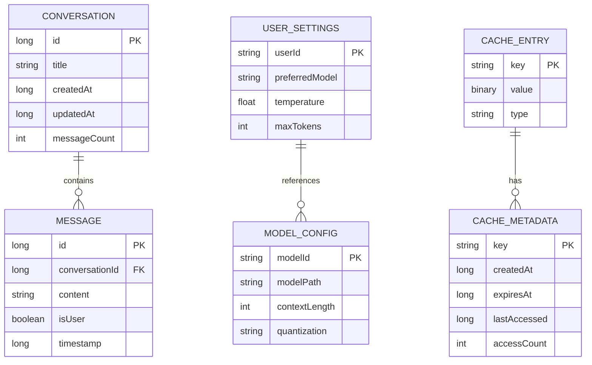

# Data Models

## Table of Contents

1. [Introduction](#introduction)
2. [Entity Relationship Diagram](#entity-relationship-diagram)
3. [Core Domain Models](#core-domain-models)
4. [Database Entities](#database-entities)
5. [Configuration Models](#configuration-models)
6. [Cache Models](#cache-models)
7. [Performance Models](#performance-models)
8. [Memory Models](#memory-models)
9. [Serialization](#serialization)
10. [Related Documents](#related-documents)

---

## Introduction

### Purpose

This document defines all data structures, entities, and models used throughout the Nimittam application. It serves as the definitive reference for data schema design and entity relationships.

### Scope

This document covers:
- Domain models for business logic
- Database entities for persistence
- Configuration models for settings
- Cache models for temporary storage
- Performance and monitoring data structures

### Data Classification

| Category | Persistence | Scope |
|----------|-------------|-------|
| Domain Models | Transient | Business logic |
| Database Entities | Persistent | Room database |
| Configuration | Persistent | Proto DataStore |
| Cache | Temporary | Memory/Disk |
| Metrics | Ephemeral | Runtime only |

---

## Entity Relationship Diagram

### High-Level Data Architecture



---

## Core Domain Models

### 3.1 ChatMessage

**Purpose**: Represents a single message in a conversation

```kotlin
data class ChatMessage(
    /**
     * Unique message identifier
     */
    val id: String = UUID.randomUUID().toString(),
    
    /**
     * Message content text
     */
    val content: String,
    
    /**
     * True if from user, false if from AI
     */
    val isUser: Boolean,
    
    /**
     * Creation timestamp (milliseconds)
     */
    val timestamp: Long = System.currentTimeMillis(),
    
    /**
     * Optional conversation reference
     */
    val conversationId: Long? = null
)
```

**Constraints**:
- `content` must not be empty
- `timestamp` must be positive

---

### 3.2 Conversation

**Purpose**: Represents a chat conversation session

```kotlin
data class Conversation(
    /**
     * Unique conversation ID (0 for new conversations)
     */
    val id: Long = 0,
    
    /**
     * Conversation title (auto-generated or user-defined)
     */
    val title: String,
    
    /**
     * Creation timestamp
     */
    val createdAt: Long = System.currentTimeMillis(),
    
    /**
     * Last update timestamp
     */
    val updatedAt: Long = System.currentTimeMillis(),
    
    /**
     * Number of messages in conversation
     */
    val messageCount: Int = 0,
    
    /**
     * Associated messages (not persisted with conversation)
     */
    val messages: List<ChatMessage> = emptyList()
)
```

**Constraints**:
- `title` max length: 100 characters
- `messageCount` must be non-negative

---

### 3.3 GenerationResult

**Purpose**: Sealed class representing LLM generation outcomes

```kotlin
sealed class GenerationResult {
    /**
     * Single generated token
     */
    data class Token(
        val text: String
    ) : GenerationResult()
    
    /**
     * Generation completed successfully
     */
    data class Complete(
        val metrics: InferenceMetrics
    ) : GenerationResult()
    
    /**
     * Generation error
     */
    data class Error(
        val message: String,
        val cause: Throwable? = null
    ) : GenerationResult()
}
```

---

### 3.4 InferenceMetrics

**Purpose**: Performance metrics for inference operations

```kotlin
data class InferenceMetrics(
    /**
     * Number of tokens in prompt
     */
    val promptTokens: Int,
    
    /**
     * Number of tokens generated
     */
    val generatedTokens: Int,
    
    /**
     * Time to process prompt (milliseconds)
     */
    val promptTimeMs: Long,
    
    /**
     * Total generation time (milliseconds)
     */
    val generationTimeMs: Long,
    
    /**
     * Calculated tokens per second
     */
    val tokensPerSecond: Float,
    
    /**
     * Hardware backend used
     */
    val backendUsed: HardwareBackend,
    
    /**
     * Timestamp of completion
     */
    val timestamp: Long = System.currentTimeMillis()
)
```

---

## Database Entities

### 4.1 ConversationEntity

**Table**: `conversations`

```kotlin
@Entity(tableName = "conversations")
data class ConversationEntity(
    @PrimaryKey(autoGenerate = true)
    val id: Long = 0,
    
    @ColumnInfo(name = "title")
    val title: String,
    
    @ColumnInfo(name = "created_at")
    val createdAt: Long,
    
    @ColumnInfo(name = "updated_at")
    val updatedAt: Long,
    
    @ColumnInfo(name = "message_count")
    val messageCount: Int
)
```

**Indices**:
- `updated_at` (for sorting)

---

### 4.2 MessageEntity

**Table**: `messages`

```kotlin
@Entity(
    tableName = "messages",
    foreignKeys = [
        ForeignKey(
            entity = ConversationEntity::class,
            parentColumns = ["id"],
            childColumns = ["conversation_id"],
            onDelete = ForeignKey.CASCADE
        )
    ],
    indices = [
        Index(value = ["conversation_id"])
    ]
)
data class MessageEntity(
    @PrimaryKey(autoGenerate = true)
    val id: Long = 0,
    
    @ColumnInfo(name = "conversation_id")
    val conversationId: Long,
    
    @ColumnInfo(name = "content")
    val content: String,
    
    @ColumnInfo(name = "is_user")
    val isUser: Boolean,
    
    @ColumnInfo(name = "timestamp")
    val timestamp: Long
)
```

---

### 4.3 Entity Mappers

```kotlin
// Conversation Mappers
fun ConversationEntity.toDomain(messages: List<ChatMessage> = emptyList()): Conversation =
    Conversation(
        id = id,
        title = title,
        createdAt = createdAt,
        updatedAt = updatedAt,
        messageCount = messageCount,
        messages = messages
    )

fun Conversation.toEntity(): ConversationEntity =
    ConversationEntity(
        id = id,
        title = title,
        createdAt = createdAt,
        updatedAt = updatedAt,
        messageCount = messageCount
    )

// Message Mappers
fun MessageEntity.toDomain(): ChatMessage =
    ChatMessage(
        id = id.toString(),
        content = content,
        isUser = isUser,
        timestamp = timestamp,
        conversationId = conversationId
    )

fun ChatMessage.toEntity(conversationId: Long): MessageEntity =
    MessageEntity(
        id = id.toLongOrNull() ?: 0,
        conversationId = conversationId,
        content = content,
        isUser = isUser,
        timestamp = timestamp
    )
```

---

## Configuration Models

### 5.1 ModelConfig

**Purpose**: LLM model configuration

```kotlin
data class ModelConfig(
    /**
     * Unique model identifier
     */
    val modelId: String,
    
    /**
     * Path to model files on device
     */
    val modelPath: String,
    
    /**
     * Maximum context length (tokens)
     */
    val contextLength: Int,
    
    /**
     * Quantization mode for model weights
     */
    val quantization: QuantizationMode,
    
    /**
     * Supported hardware backends
     */
    val supportedBackends: List<HardwareBackend>
)

enum class QuantizationMode {
    Q4_0,   // 4-bit, no grouping
    Q4_1,   // 4-bit, grouped
    Q5_0,   // 5-bit, no grouping
    Q5_1,   // 5-bit, grouped
    Q8_0,   // 8-bit, no grouping
    FP16,   // 16-bit float
    FP32    // 32-bit float
}
```

---

### 5.2 GenerationParams

**Purpose**: Parameters for text generation

```kotlin
data class GenerationParams(
    /**
     * Maximum tokens to generate
     */
    val maxTokens: Int = 1024,
    
    /**
     * Sampling temperature (0.0 - 2.0)
     * Higher = more random, Lower = more deterministic
     */
    val temperature: Float = 0.7f,
    
    /**
     * Nucleus sampling parameter (0.0 - 1.0)
     */
    val topP: Float = 0.9f,
    
    /**
     * Top-k sampling parameter
     */
    val topK: Int = 40,
    
    /**
     * Repetition penalty (1.0 = no penalty)
     */
    val repetitionPenalty: Float = 1.0f,
    
    /**
     * Preferred hardware backend
     */
    val preferredBackend: HardwareBackend = HardwareBackend.VULKAN_GPU,
    
    /**
     * Stop sequences to end generation
     */
    val stopSequences: List<String> = emptyList()
) {
    init {
        require(maxTokens > 0) { "maxTokens must be positive" }
        require(temperature in 0.0..2.0) { "temperature must be in [0, 2]" }
        require(topP in 0.0..1.0) { "topP must be in [0, 1]" }
    }
}
```

---

### 5.3 UserPreferences

**Purpose**: User settings and preferences

```kotlin
data class UserPreferences(
    /**
     * Selected model ID
     */
    val selectedModel: String,
    
    /**
     * Default generation parameters
     */
    val defaultParams: GenerationParams,
    
    /**
     * Theme setting
     */
    val theme: ThemeMode,
    
    /**
     * Enable haptic feedback
     */
    val hapticFeedback: Boolean,
    
    /**
     * Auto-save conversations
     */
    val autoSaveConversations: Boolean,
    
    /**
     * Maximum conversations to keep
     */
    val maxConversations: Int
)

enum class ThemeMode {
    LIGHT,
    DARK,
    SYSTEM
}
```

---

## Cache Models

### 6.1 CacheEntry

**Purpose**: Generic cache entry wrapper

```kotlin
data class CacheEntry<T>(
    /**
     * Cached value
     */
    val value: T,
    
    /**
     * Cache metadata
     */
    val metadata: CacheMetadata
)
```

---

### 6.2 CacheMetadata

**Purpose**: Metadata for cache entries

```kotlin
data class CacheMetadata(
    /**
     * Entry creation timestamp
     */
    val createdAt: Long = System.currentTimeMillis(),
    
    /**
     * Expiration timestamp (null = no expiration)
     */
    val expiresAt: Long? = null,
    
    /**
     * Last access timestamp
     */
    val lastAccessed: Long = System.currentTimeMillis(),
    
    /**
     * Number of times accessed
     */
    val accessCount: Int = 0
) {
    /**
     * Check if entry is expired
     */
    fun isExpired(): Boolean = expiresAt?.let { 
        System.currentTimeMillis() > it 
    } ?: false
    
    /**
     * Check if entry is stale (for SWR pattern)
     */
    fun isStale(staleThresholdMs: Long = 60000): Boolean = 
        System.currentTimeMillis() - lastAccessed > staleThresholdMs
    
    /**
     * Create copy with updated access info
     */
    fun withAccess(): CacheMetadata = copy(
        lastAccessed = System.currentTimeMillis(),
        accessCount = accessCount + 1
    )
}
```

---

### 6.3 CachedResource

**Purpose**: Sealed class for stale-while-revalidate pattern

```kotlin
sealed class CachedResource<T> {
    abstract val data: T?
    
    data class Success<T>(
        override val data: T,
        val isFromCache: Boolean,
        val isStale: Boolean
    ) : CachedResource<T>()
    
    data class Error<T>(
        val exception: Throwable,
        override val data: T? = null
    ) : CachedResource<T>()
    
    class Loading<T> : CachedResource<T>() {
        override val data: T? = null
    }
}
```

---

### 6.4 CacheStats

**Purpose**: Cache performance statistics

```kotlin
data class CacheStats(
    /**
     * Total cache hits
     */
    val totalHits: Long = 0,
    
    /**
     * Total cache misses
     */
    val totalMisses: Long = 0,
    
    /**
     * Current hit rate (0.0 - 1.0)
     */
    val hitRate: Float = 0f,
    
    /**
     * L1 cache size (entries)
     */
    val l1Size: Int = 0,
    
    /**
     * L2 cache size (entries)
     */
    val l2Size: Int = 0,
    
    /**
     * Memory usage in bytes
     */
    val memoryUsageBytes: Long = 0
) {
    /**
     * Calculate hit rate
     */
    fun calculateHitRate(): Float {
        val total = totalHits + totalMisses
        return if (total > 0) totalHits.toFloat() / total else 0f
    }
}
```

---

## Performance Models

### 7.1 FrameMetrics

**Purpose**: UI frame timing metrics

```kotlin
data class FrameMetrics(
    /**
     * Frame duration in milliseconds
     */
    val frameTimeMs: Float,
    
    /**
     * True if frame exceeded 16.67ms (60fps budget)
     */
    val isJank: Boolean,
    
    /**
     * Timestamp of frame
     */
    val timestamp: Long
) {
    companion object {
        const val FRAME_TIME_BUDGET = 16.67f
        
        fun fromFrameTime(frameTimeMs: Float): FrameMetrics =
            FrameMetrics(
                frameTimeMs = frameTimeMs,
                isJank = frameTimeMs > FRAME_TIME_BUDGET,
                timestamp = System.currentTimeMillis()
            )
    }
}
```

---

### 7.2 MemoryMetrics

**Purpose**: System memory usage metrics

```kotlin
data class MemoryMetrics(
    /**
     * Total heap size in bytes
     */
    val heapSize: Long,
    
    /**
     * Used heap in bytes
     */
    val heapUsed: Long,
    
    /**
     * Native heap size in bytes
     */
    val nativeHeap: Long,
    
    /**
     * Total PSS (Proportional Set Size) in bytes
     */
    val totalPss: Long,
    
    /**
     * Available system memory in bytes
     */
    val availableMemory: Long,
    
    /**
     * Timestamp of measurement
     */
    val timestamp: Long = System.currentTimeMillis()
) {
    /**
     * Calculate heap usage percentage
     */
    fun heapUsagePercent(): Float = 
        if (heapSize > 0) heapUsed.toFloat() / heapSize * 100 else 0f
    
    /**
     * Calculate total memory usage percentage
     */
    fun totalUsagePercent(totalMemory: Long): Float =
        if (totalMemory > 0) (heapUsed + nativeHeap).toFloat() / totalMemory * 100 else 0f
}
```

---

### 7.3 PerformanceReport

**Purpose**: Aggregated performance report

```kotlin
data class PerformanceReport(
    /**
     * Report timestamp
     */
    val timestamp: Long,
    
    /**
     * Average frame time over reporting period
     */
    val averageFrameTime: Float,
    
    /**
     * Number of jank frames
     */
    val jankFrames: Int,
    
    /**
     * Total frames rendered
     */
    val totalFrames: Int,
    
    /**
     * Memory metrics snapshot
     */
    val memoryUsage: MemoryMetrics,
    
    /**
     * CPU usage percentage
     */
    val cpuUsage: Float,
    
    /**
     * Jank rate (0.0 - 1.0)
     */
    val jankRate: Float = if (totalFrames > 0) jankFrames.toFloat() / totalFrames else 0f
)
```

---

## Memory Models

### 8.1 MemoryPressure

**Purpose**: Memory pressure enumeration

```kotlin
enum class MemoryPressure(
    /**
     * Threshold percentage for this level
     */
    val threshold: Float
) {
    NORMAL(0.70f),
    ELEVATED(0.80f),
    HIGH(0.90f),
    CRITICAL(0.95f);
    
    /**
     * Determine pressure level from usage percentage
     */
    companion object {
        fun fromUsage(usagePercent: Float): MemoryPressure =
            when {
                usagePercent >= CRITICAL.threshold -> CRITICAL
                usagePercent >= HIGH.threshold -> HIGH
                usagePercent >= ELEVATED.threshold -> ELEVATED
                else -> NORMAL
            }
    }
}
```

---

### 8.2 MemoryProfile

**Purpose**: Adaptive memory configuration profile

```kotlin
data class MemoryProfile(
    /**
     * Maximum tokens for generation
     */
    val maxTokens: Int,
    
    /**
     * Maximum cache size in MB
     */
    val maxCacheSizeMB: Int,
    
    /**
     * Enable UI animations
     */
    val enableAnimations: Boolean,
    
    /**
     * GC trigger threshold (0.0 - 1.0)
     */
    val gcThreshold: Float
)
```

---

### 8.3 MemoryStats

**Purpose**: Memory statistics snapshot

```kotlin
data class MemoryStats(
    /**
     * Total device memory in MB
     */
    val totalMemoryMB: Long,
    
    /**
     * Available memory in MB
     */
    val availableMemoryMB: Long,
    
    /**
     * Used memory in MB
     */
    val usedMemoryMB: Long,
    
    /**
     * Memory usage percentage
     */
    val usagePercent: Float
)
```

---

## Serialization

### 9.1 Proto DataStore Schema

**File**: `settings.proto`

```protobuf
syntax = "proto3";

message UserSettings {
    string selected_model = 1;
    GenerationParams default_params = 2;
    ThemeMode theme = 3;
    bool haptic_feedback = 4;
    bool auto_save_conversations = 5;
    int32 max_conversations = 6;
}

message GenerationParams {
    int32 max_tokens = 1;
    float temperature = 2;
    float top_p = 3;
    int32 top_k = 4;
    float repetition_penalty = 5;
    HardwareBackend preferred_backend = 6;
    repeated string stop_sequences = 7;
}

enum ThemeMode {
    LIGHT = 0;
    DARK = 1;
    SYSTEM = 2;
}

enum HardwareBackend {
    CPU = 0;
    VULKAN_GPU = 1;
    OPENCL_GPU = 2;
    NPU_HEXAGON = 3;
}
```

---

### 9.2 JSON Serialization

**Cache serialization uses JSON for disk cache:**

```kotlin
// Cache entry JSON structure
{
    "value": <serialized_value>,
    "metadata": {
        "createdAt": 1706784000000,
        "expiresAt": 1706870400000,
        "lastAccessed": 1706787600000,
        "accessCount": 5
    }
}
```

---

## Related Documents

| Document | Relationship | Description |
|----------|--------------|-------------|
| [Interfaces](interfaces.md) | Uses | API contracts using these models |
| [Traceability](traceability.md) | Maps to | Requirements mapping |
| [Architecture Overview](../architecture/overview.md) | Context | High-level architecture |
| [Glossary](../references/glossary.md) | Reference | Terminology |

---

*Document maintained by the Technical Architecture Team*  
*Last updated: 2026-02-01*  
*Classification: IEEE 830-1998*
