# System Diagrams

## Table of Contents

1. [Architecture Diagrams](#architecture-diagrams)
2. [Sequence Diagrams](#sequence-diagrams)
3. [State Diagrams](#state-diagrams)
4. [Component Diagrams](#component-diagrams)
5. [Data Flow Diagrams](#data-flow-diagrams)
6. [Related Documents](#related-documents)

---

## Architecture Diagrams

### System Context Diagram

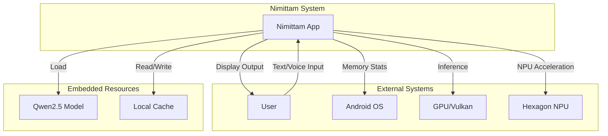

### Layered Architecture

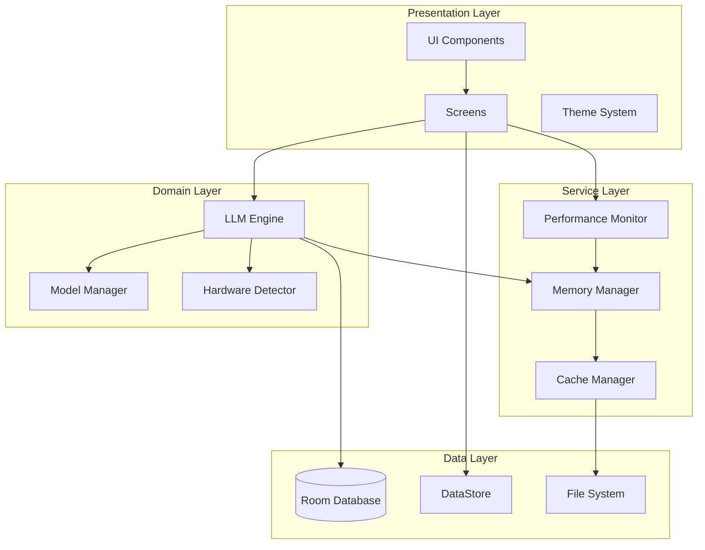

### Module Hierarchy

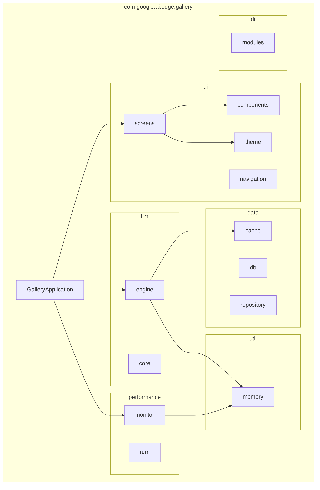

---

## Sequence Diagrams

### Token Generation Flow

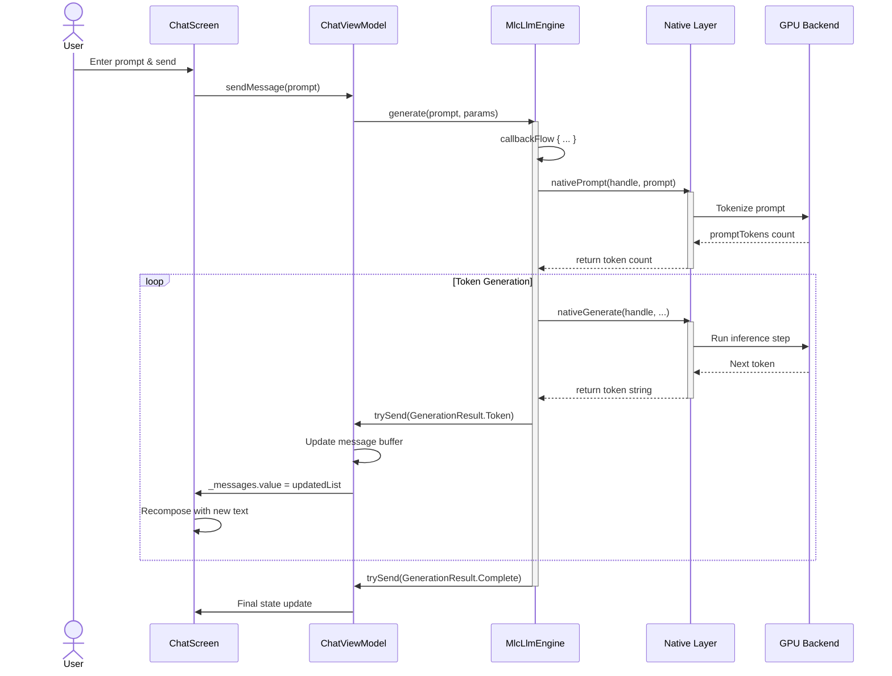

### Memory Pressure Adaptation

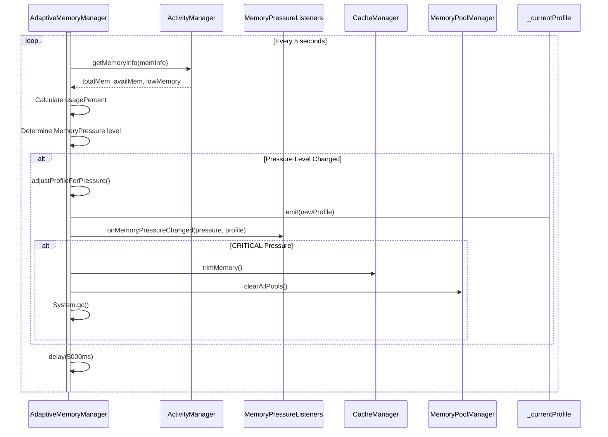

### Cache Resolution Flow

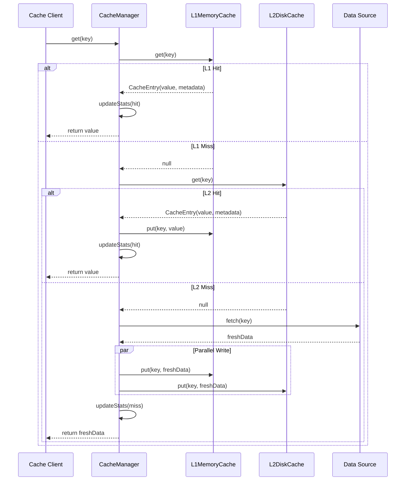

### UI State Flow

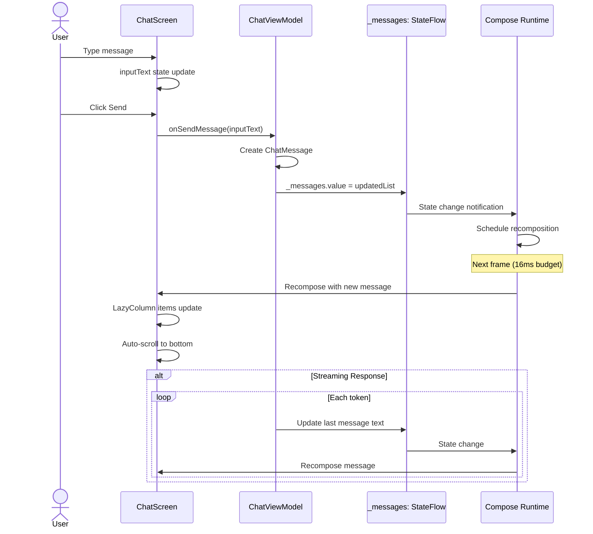

---

## State Diagrams

### LLM Engine State Machine

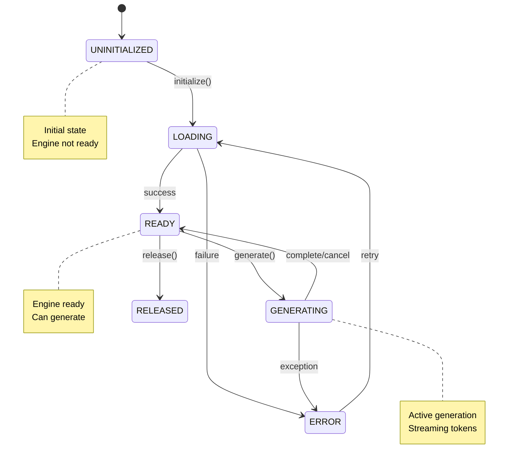

### Memory Pressure State Machine

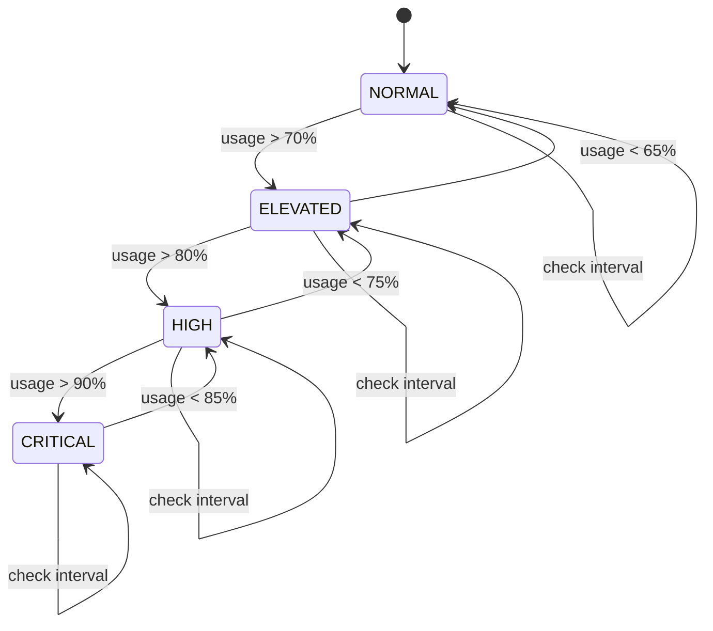

### Cache Entry Lifecycle

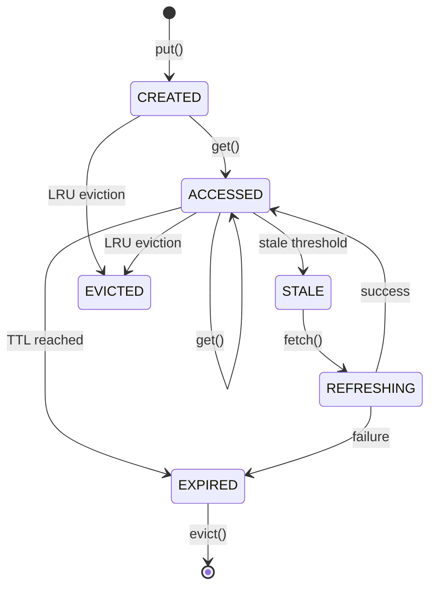

---

## Component Diagrams

### Dependency Injection Graph

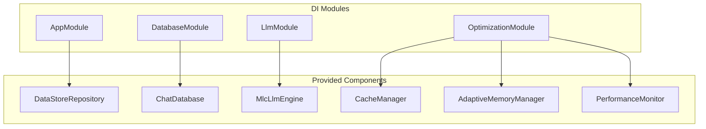

### Component Dependencies

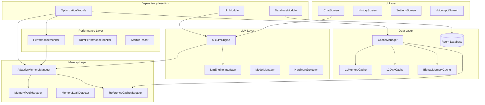

---

## Data Flow Diagrams

### Data Flow - Chat Message

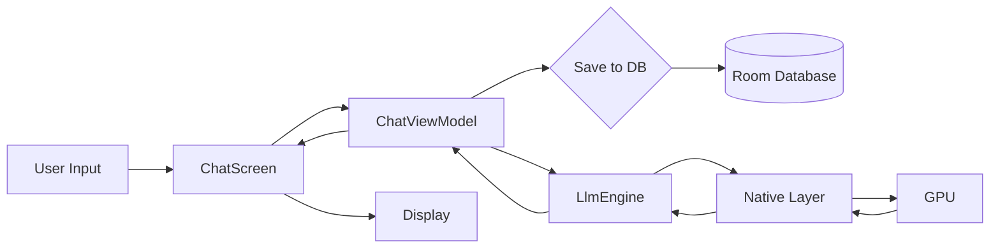

### Data Flow - Cache Operation

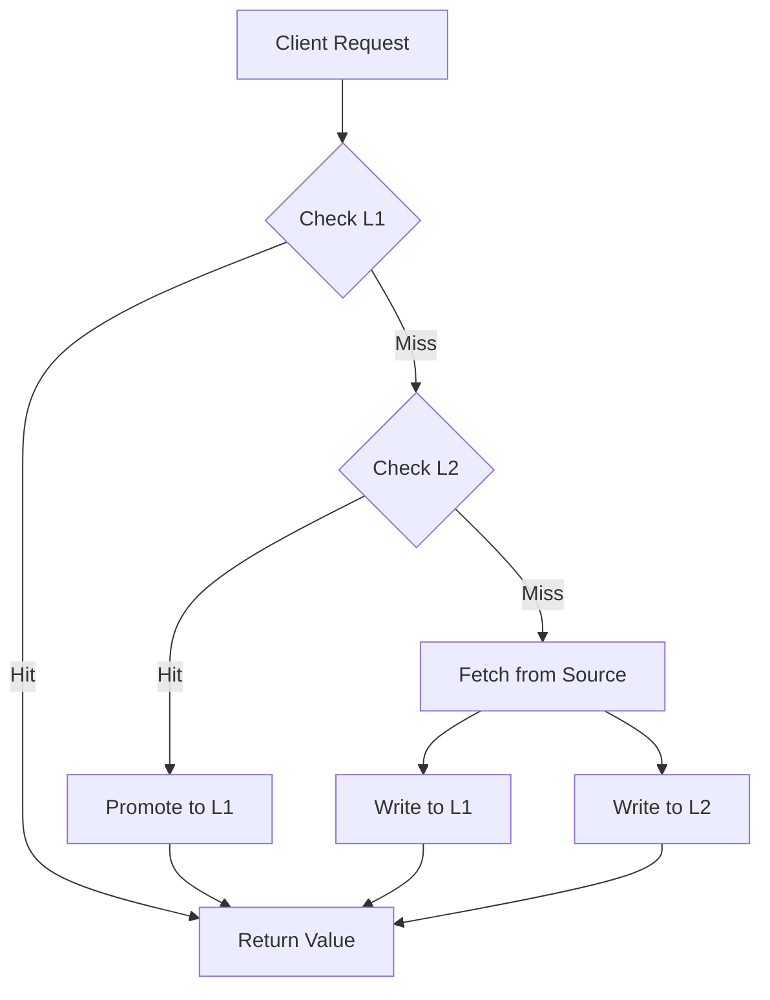

### Data Flow - Memory Monitoring

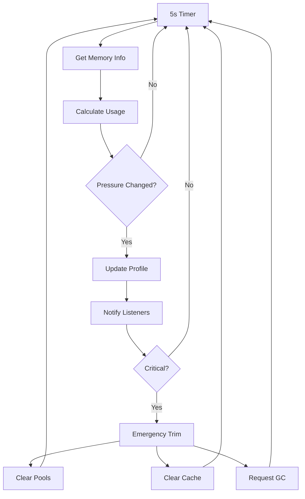

---

## Related Documents

| Document | Relationship | Description |
|----------|--------------|-------------|
| [Architecture Overview](../architecture/overview.md) | Describes | High-level architecture |
| [Components](../architecture/components.md) | Details | Component breakdown |
| [Interactive Visualizations](interactive.md) | Complements | p5.js visualizations |
| [Glossary](../references/glossary.md) | Reference | Terminology |

---

*Document maintained by the Technical Architecture Team*  
*Last updated: 2026-02-01*  
*Classification: ISO/IEC/IEEE 42010*
